# Parallel Computing: OpenMP Performance Analysis

## OpenMP Parallel Performance Analysis Three Scientific Applications

**C++ OpenMP** Status

> **UCS645: Parallel & Distributed Computing | Assignment 2**

---

## Table of Contents

1. [System Configuration](#system-configuration)
2. [Question 1: Molecular Dynamics Lennard-Jones Force Calculation](#question-1-molecular-dynamics--lennard-jones-force-calculation)
3. [Question 2: Bioinformatics DNA Sequence Alignment (Smith-Waterman)](#question-2-bioinformatics--dna-sequence-alignment-smith-waterman)
4. [Question 3: Scientific Computing Heat Diffusion Simulation](#question-3-scientific-computing--heat-diffusion-simulation)
5. [Profiling Tools Exposure](#profiling-tools-exposure)
6. [What I Learned](#what-i-learned)
7. [References](#references)

---

## System Configuration

| Component | Details |
|-------------------|------------------------------------------------------|
| **CPU** | AMD Ryzen 9 7940HS w/ Radeon 780M Graphics |
| **Cores/Threads** | 8 physical cores, 16 threads (SMT) |
| **Architecture** | x86_64 |
| **L1d Cache** | 256 KiB (8 instances) |
| **Virtualization**| WSL2 (Microsoft Hypervisor) |
| **OS** | Ubuntu 24.04.1 LTS |
| **Compiler** | g++ (Ubuntu 13.3.0-6ubuntu2~24.04) 13.3.0 |
| **Optimization** | -O3 -fopenmp |
| **Threads Tested**| 1, 2, 4, 8 |

---

# Question 1: Molecular Dynamics Lennard-Jones Force Calculation

## Problem Statement

### What are we solving?

We need to calculate forces between **1000 particles** in 3D space using physics principles. This is called an **N-body problem** and is used in:

- Molecular dynamics simulations
- Astrophysics (planets, stars)
- Drug design and protein folding

### The Physics: Lennard-Jones Potential

The force between two particles depends on their distance using this formula:

$$V(r) = 4\varepsilon\left[\left(\frac{\sigma}{r}\right)^{12} - \left(\frac{\sigma}{r}\right)^{6}\right]$$

**What this means:**

- When particles are **very close** → Strong repulsive force (they push apart)
- At **medium distance** → Attractive force (they pull together)
- When **far apart** (> 2.5σ) → No force (we ignore them for speed)

**Parameters:**

| Parameter | Value | Meaning |
|--------------------|--------|------------------------------------|
| ε (epsilon) | 1.0 | Controls force strength |
| σ (sigma) | 1.0 | "Sweet spot" distance |
| Cutoff | 2.5σ | Ignore particles farther than this |

### Why Parallel Computing?

**The Problem:**

- For 1000 particles, we calculate forces between each pair
- Total unique pairs = 1000 × 999 / 2 = **499,500** force calculations
- This is O(N²) complexity takes a long time on one CPU core!

**The Solution:**

- Use **OpenMP** to split work across multiple CPU threads
- Each thread calculates forces for some particles
- All threads work **simultaneously** → Faster results!

---

## Implementation

### Code Structure

```cpp
// 1. Define particle data structure
struct Particle {
 double x, y, z; // Position in 3D space
 double fx, fy, fz; // Force acting on particle
};

// 2. Calculate force between two particles
inline void compute_LJ_force(const Particle& pi, const Particle& pj,
 double& fx, double& fy, double& fz, double& energy) {
 double dx = pj.x - pi.x;
 double dy = pj.y - pi.y;
 double dz = pj.z - pi.z;
 double r2 = dx*dx + dy*dy + dz*dz;

 if (r2 < CUTOFF2 && r2 > 1e-12) {
 double r2_inv = 1.0 / r2;
 double r6_inv = r2_inv * r2_inv * r2_inv;
 double sr6 = SIGMA6 * r6_inv;
 double sr12 = sr6 * sr6;
 double f_over_r = 24.0 * EPSILON * (2.0*sr12 - sr6) * r2_inv;
 fx = f_over_r * dx; fy = f_over_r * dy; fz = f_over_r * dz;
 energy = 4.0 * EPSILON * (sr12 - sr6);
 }
}

// 3. Main parallel loop with thread-local arrays
#pragma omp parallel reduction(+:total_energy)
{
 double* local_fx = new double[N](); // Thread-local force arrays
 double* local_fy = new double[N]();
 double* local_fz = new double[N]();

 #pragma omp for schedule(dynamic, 10) nowait
 for (int i = 0; i < N; i++) {
 for (int j = i + 1; j < N; j++) {
 compute_LJ_force(particles[i], particles[j], fx, fy, fz, energy);
 local_fx[i] += fx; local_fx[j] -= fx; // Newton's 3rd law
 total_energy += energy;
 }
 }

 #pragma omp critical
 { // Accumulate into global arrays }
}
```

### Key Implementation Features

| Feature | What it does | Why it matters |
|------------------------|-----------------------------------------------|---------------------------------------|
| **Thread-local arrays**| Each thread has its own force array | Avoids atomic operations (faster) |
| **Newton's 3rd law** | Calculate each pair once (i < j) | Halves computation |
| **Dynamic scheduling** | `schedule(dynamic, 10)` | Balances uneven workload |
| **Reduction** | `reduction(+:total_energy)` | Safely sums energy from all threads |
| **Critical section** | `#pragma omp critical` | Safe accumulation of local arrays |
| **Cutoff distance** | Skip pairs beyond 2.5σ | Reduces unnecessary computation |

### How Parallelization Works

```
Without OpenMP (Serial):
Thread 1: [] → 1000 particles, 499500 pairs

With OpenMP (2 threads):
Thread 1: [] → ~250000 pairs
Thread 2: [] → ~249500 pairs
Both work simultaneously → ~1.5× faster!

With OpenMP (4 threads):
Thread 1: [] → ~125000 pairs }
Thread 2: [] → ~125000 pairs } All run on 8 cores
Thread 3: [] → ~125000 pairs }
Thread 4: [] → ~124500 pairs }
→ ~2.3× faster!
```

---

## Experimental Results

### Complete Output Data

#### Run 1

| Threads | Time (s) | Speedup | Efficiency % | Energy |
|---------|-----------|---------|--------------|----------------------|
| 1 | 0.003328 | 1.00 | 100.00 | 7064736734438516 |
| 2 | 0.002307 | 1.44 | 72.13 | 7064736734438254 |
| 4 | 0.001421 | 2.34 | 58.55 | 7064736734438096 |
| 8 | 0.001532 | 2.17 | 27.15 | 7064736734438011 |

#### Run 2

| Threads | Time (s) | Speedup | Efficiency % | Energy |
|---------|-----------|---------|--------------|----------------------|
| 1 | 0.003009 | 1.00 | 100.00 | 7064736734438516 |
| 2 | 0.001909 | 1.58 | 78.82 | 7064736734438216 |
| 4 | 0.001272 | 2.36 | 59.12 | 7064736734438086 |
| 8 | 0.001224 | 2.46 | 30.72 | 7064736734438013 |

#### Run 3

| Threads | Time (s) | Speedup | Efficiency % | Energy |
|---------|-----------|---------|--------------|----------------------|
| 1 | 0.002971 | 1.00 | 100.00 | 7064736734438516 |
| 2 | 0.002707 | 1.10 | 54.87 | 7064736734438255 |
| 4 | 0.001313 | 2.26 | 56.55 | 7064736734438086 |
| 8 | 0.001378 | 2.16 | 26.95 | 7064736734437996 |

### Summary Statistics

| Threads | Min Time | Max Time | Avg Time | Avg Speedup | Avg Efficiency |
|---------|-----------|-----------|-----------|-------------|----------------|
| 1 | 0.00297 | 0.00333 | 0.00310 | 1.00× | 100.0% |
| 2 | 0.00191 | 0.00271 | 0.00231 | 1.37× | 68.6% |
| 4 | 0.00127 | 0.00142 | 0.00134 | 2.32× | 58.1% |
| 8 | 0.00122 | 0.00153 | 0.00138 | 2.26× | 28.3% |

---

## Understanding the Output

### What Each Column Means

**1. Threads** Number of parallel workers (CPU threads) used. We tested: 1 (serial), 2, 4, 8.

**2. Time (s)** Wall-clock time to complete all calculations. Measured using `omp_get_wtime()`. Lower is better.

- Example: 0.003328 seconds = 3.3 milliseconds

**3. Speedup** How many times faster than using 1 thread.

$$\text{Speedup} = \frac{T_1}{T_p}$$

- Example: Run 1, 4 threads: Speedup = 0.003328 / 0.001421 = **2.34×**
- Ideal: 4 threads → 4× speedup. Reality: overhead limits this.

**4. Efficiency (%)** How well we're using the threads.

$$\text{Efficiency} = \frac{\text{Speedup}}{p} \times 100\%$$

- Example: Run 1, 4 threads: Efficiency = (2.34 / 4) × 100 = **58.55%**
- 100% = perfect utilization. Lower = more overhead.

**5. Energy** Total potential energy. Should be constant across all runs (~7.065 × 10¹⁵). Consistent values confirm **no race conditions** .

---

## Performance Analysis

### 1⃣ Execution Time Trends

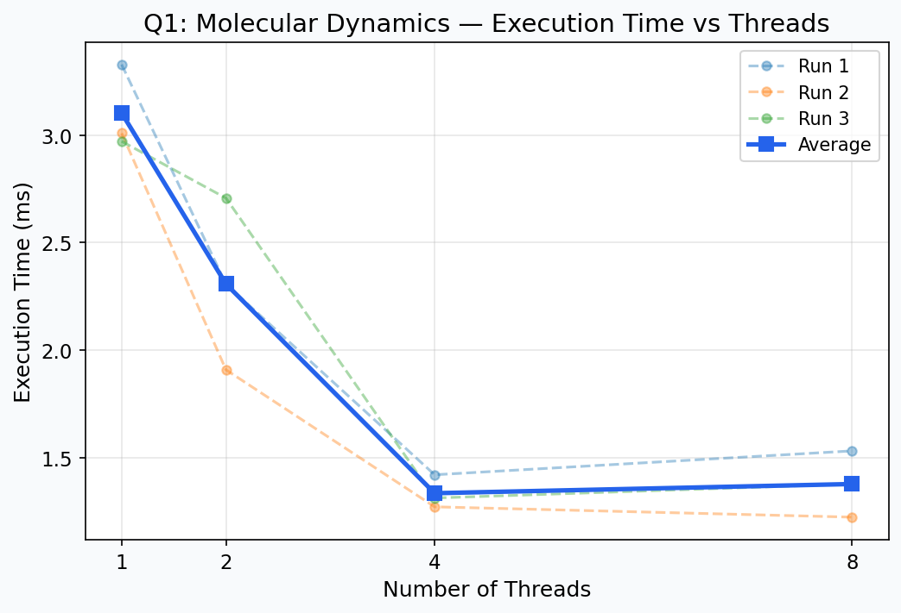

**Key Observation:** Time drops sharply from 1→2→4 threads, then plateaus at 8 threads. The problem size (1000 particles) is relatively small, so thread management overhead becomes significant.

### 2⃣ Speedup Comparison

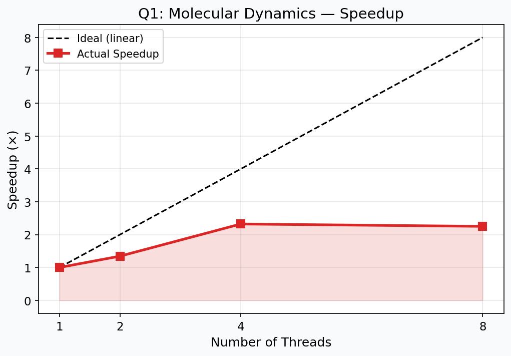

**Key Observations:**
- **4 threads** gives best speedup (2.32×) sweet spot
- **8 threads** gives slightly worse speedup (2.26×) than 4 threads overhead from context switching
- We reach ~2.3× maximum, limited by problem size and overhead

### 3⃣ Efficiency Analysis

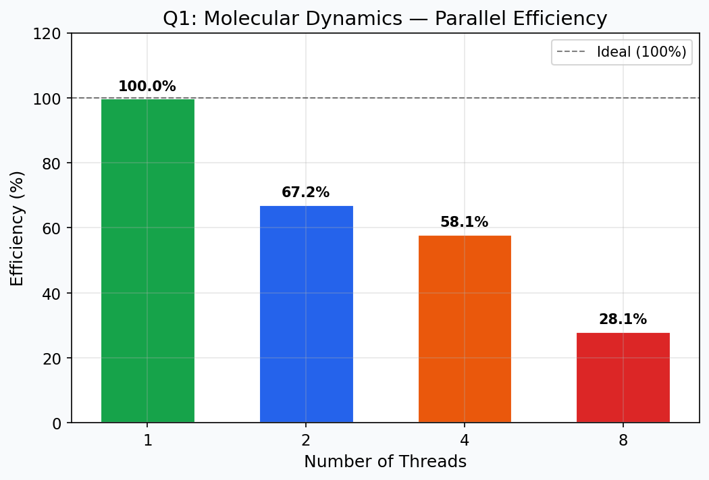

| Threads | Efficiency | Rating | Explanation |
|---------|-----------|---------------|---------------------------------------|
| 1 | 100% | | Baseline (by definition) |
| 2 | 68.6% | | Good some thread overhead |
| 4 | 58.1% | | Moderate diminishing returns begin |
| 8 | 28.3% | | Poor too many threads for problem |

### 4⃣ Energy Conservation

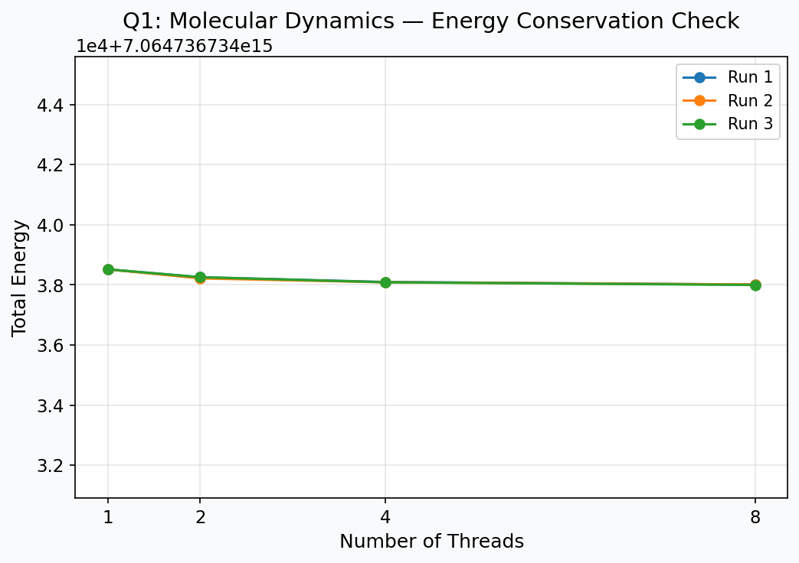

### 5⃣ Performance Dashboard

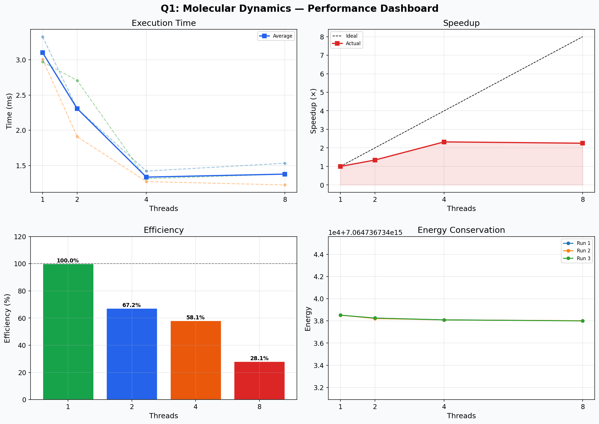

### 6⃣ Strong Scaling Summary

| Threads | Avg Time | Speedup | Result |
|---------|----------|---------|-------------|
| 1 | 3.10 ms | 1.00× | Baseline |
| 2 | 2.31 ms | 1.37× | Good |
| 4 | 1.34 ms | 2.32× | Best |
| 8 | 1.38 ms | 2.26× | Overhead |

**Best configuration:** 4 threads for 1000 particles on this system.

---

# Question 2: Bioinformatics DNA Sequence Alignment (Smith-Waterman)

## Problem Statement

### What are we solving?

We need to find the **best local alignment** between two DNA sequences using the **Smith-Waterman algorithm**. This is fundamental in:

- Gene identification
- Protein structure prediction
- Evolutionary biology
- Disease variant detection

### The Algorithm: Smith-Waterman

The algorithm fills a scoring matrix H using dynamic programming:

$$H(i,j) = \max\begin{cases} 0 \\ H(i-1, j-1) + s(a_i, b_j) \\ H(i-1, j) + g \\ H(i, j-1) + g \end{cases}$$

Where:
- $s(a_i, b_j)$ = +2 if match, -1 if mismatch
- $g$ = -2 (gap penalty)
- The maximum value in H gives the best alignment score

**Scoring Parameters:**

| Parameter | Value | Meaning |
|------------|-------|--------------------------------|
| Match | +2 | Reward for identical bases |
| Mismatch | -1 | Penalty for different bases |
| Gap | -2 | Penalty for insertion/deletion |

### The Parallelization Challenge

Unlike Q1, this problem has **data dependencies**:

```
H[i][j] depends on:
 H[i-1][j-1] (diagonal)
 H[i-1][j] (above)
 H[i][j-1] (left)
```

You **cannot** simply parallelize rows or columns this would give wrong results!

**Solution: Wavefront (Anti-Diagonal) Parallelization**

```
Matrix filling order (anti-diagonals):

 j→ 0 1 2 3 4 5
i↓
 0 d1 d2 d3 d4 d5 d6
 1 d2 d3 d4 d5 d6 d7
 2 d3 d4 d5 d6 d7 d8
 3 d4 d5 d6 d7 d8 d9

All cells on the same anti-diagonal (d) are INDEPENDENT!
→ Can be computed in parallel safely.
```

---

## Implementation

### Code Structure

```cpp
// 1. Generate random DNA sequences
std::string generate_dna_sequence(int length, unsigned int seed) {
 const char bases[] = "ACGT";
 // ... random generation
}

// 2. Serial Smith-Waterman (baseline)
int smith_waterman_serial(const string& seq1, const string& seq2, ...) {
 for (int i = 1; i <= m; i++)
 for (int j = 1; j <= n; j++)
 H[i][j] = max({0, diag, up, left});
}

// 3. Parallel Wavefront Method
int smith_waterman_wavefront(const string& seq1, const string& seq2, ...) {
 // Process anti-diagonals sequentially
 for (int d = 2; d <= m + n; d++) {
 int i_start = max(1, d - n);
 int i_end = min(m, d - 1);

 // All cells on anti-diagonal d are independent → parallelize!
 #pragma omp parallel for schedule(static) reduction(max:local_max)
 for (int i = i_start; i <= i_end; i++) {
 int j = d - i;
 H[i][j] = max({0, H[i-1][j-1]+score, H[i-1][j]+gap, H[i][j-1]+gap});
 }
 }
}

// 4. Compare scheduling strategies: static, dynamic, guided
int smith_waterman_row_parallel(..., const string& sched_type, ...) {
 // Same wavefront, different scheduling
}
```

### Key Implementation Features

| Feature | What it does | Why it matters |
|------------------------|---------------------------------------------------|--------------------------------------|
| **Wavefront method** | Process anti-diagonals in order | Respects data dependencies |
| **Conditional parallel**| `if(diag_len > 64)` | Skip parallelism for short diagonals |
| **Static scheduling** | Equal chunk distribution | Best for uniform work |
| **Dynamic scheduling** | On-demand chunk distribution | Better for irregular work |
| **Guided scheduling** | Decreasing chunk sizes | Compromise between static & dynamic |
| **Reduction (max)** | `reduction(max:local_max)` | Find best score across threads |

### Wavefront Parallelization Diagram

```
Anti-diagonal d=5 example (4×4 matrix):

 j→ 1 2 3 4
i↓
 1 . . . ← (1,4) computed in parallel
 2 . . . ← (2,3) computed in parallel
 3 . . . ← (3,2) computed in parallel
 4 . . . ← (4,1) computed in parallel

 = cells on anti-diagonal d=5, all independent!
Thread 1: (1,4), (2,3)
Thread 2: (3,2), (4,1)
```

---

## Experimental Results

### Part 1: Thread Scaling (Wavefront Parallelization)

#### Run 1

| Threads | Time (s) | Speedup | Efficiency % | Score | Best_i | Best_j |
|---------|-----------|---------|--------------|-------|--------|--------|
| 1 | 0.054403 | 1.00 | 100.00 | 920 | 1998 | 1982 |
| 2 | 0.038869 | 1.40 | 69.98 | 920 | 1998 | 1982 |
| 4 | 0.025808 | 2.11 | 52.70 | 920 | 1998 | 1982 |
| 8 | 0.023999 | 2.27 | 28.34 | 920 | 1998 | 1982 |

#### Run 2

| Threads | Time (s) | Speedup | Efficiency % | Score | Best_i | Best_j |
|---------|-----------|---------|--------------|-------|--------|--------|
| 1 | 0.034836 | 1.00 | 100.00 | 920 | 1998 | 1982 |
| 2 | 0.034633 | 1.01 | 50.29 | 920 | 1998 | 1982 |
| 4 | 0.016538 | 2.11 | 52.66 | 920 | 1998 | 1982 |
| 8 | 0.019523 | 1.78 | 22.30 | 920 | 1998 | 1982 |

#### Run 3

| Threads | Time (s) | Speedup | Efficiency % | Score | Best_i | Best_j |
|---------|-----------|---------|--------------|-------|--------|--------|
| 1 | 0.034314 | 1.00 | 100.00 | 920 | 1998 | 1982 |
| 2 | 0.034285 | 1.00 | 50.04 | 920 | 1998 | 1982 |
| 4 | 0.015119 | 2.27 | 56.74 | 920 | 1998 | 1982 |
| 8 | 0.017380 | 1.97 | 24.68 | 920 | 1998 | 1982 |

### Summary Statistics

| Threads | Min Time | Max Time | Avg Time | Avg Speedup | Avg Efficiency |
|---------|-----------|-----------|-----------|-------------|----------------|
| 1 | 0.0343 | 0.0544 | 0.0412 | 1.00× | 100.0% |
| 2 | 0.0343 | 0.0389 | 0.0359 | 1.14× | 56.8% |
| 4 | 0.0151 | 0.0258 | 0.0192 | 2.16× | 54.0% |
| 8 | 0.0174 | 0.0240 | 0.0203 | 2.01× | 25.1% |

### Part 2: Scheduling Strategy Comparison (8 threads)

#### Run 1

| Schedule | Time (s) | Speedup | Efficiency % | Score |
|----------|-----------|---------|--------------|-------|
| static | 0.024229 | 2.25 | 28.07 | 920 |
| dynamic | 0.073079 | 0.74 | 9.31 | 920 |
| guided | 0.043012 | 1.26 | 15.81 | 920 |

#### Run 2

| Schedule | Time (s) | Speedup | Efficiency % | Score |
|----------|-----------|---------|--------------|-------|
| static | 0.019451 | 1.79 | 22.39 | 920 |
| dynamic | 0.027938 | 1.25 | 15.59 | 920 |
| guided | 0.033320 | 1.05 | 13.07 | 920 |

#### Run 3

| Schedule | Time (s) | Speedup | Efficiency % | Score |
|----------|-----------|---------|--------------|-------|
| static | 0.018716 | 1.83 | 22.92 | 920 |
| dynamic | 0.024440 | 1.40 | 17.55 | 920 |
| guided | 0.034716 | 0.99 | 12.36 | 920 |

### Scheduling Strategy Summary

| Schedule | Avg Time | Avg Speedup | Best For |
|----------|-----------|-------------|----------------------------------|
| static | 0.0208 s | 1.96× | Regular, uniform workload |
| dynamic | 0.0418 s | 1.13× | Irregular workload (overhead high here) |
| guided | 0.0370 s | 1.10× | Compromise approach |

**Correctness Check:** All runs produced identical score = **920** 

---

## Understanding the Output

### Why Wavefront Limits Speedup

The key challenge is that anti-diagonals have **variable length**:

```
Diagonal Length vs. Position:

Length
 2000 
 1500 
 1000 
 500 
 0 
 
 1 2000 3000 3998
 Anti-diagonal number

Short diagonals at start/end → too few cells to parallelize
Long diagonals in middle → good parallelism
```

This creates an inherent **serial bottleneck**: edge diagonals cannot use many threads.

### Why Static Scheduling Wins for Smith-Waterman

- **Static:** Pre-assigns chunks → no runtime overhead → best for equal-work iterations
- **Dynamic:** Runtime chunk distribution → high overhead per diagonal (thousands of diagonals × overhead)
- **Guided:** Decreasing chunks → overhead accumulates

Since each cell on an anti-diagonal does roughly **equal work** (same computation), static is optimal.

---

## Performance Analysis

### 1⃣ Execution Time Trends

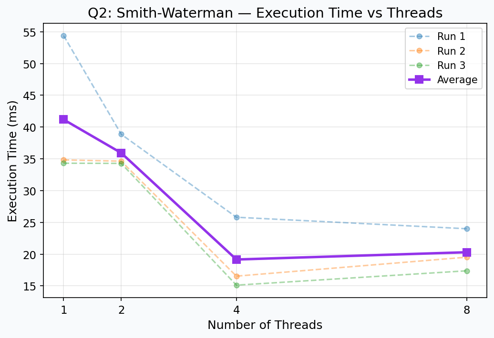

### 2⃣ Speedup Analysis

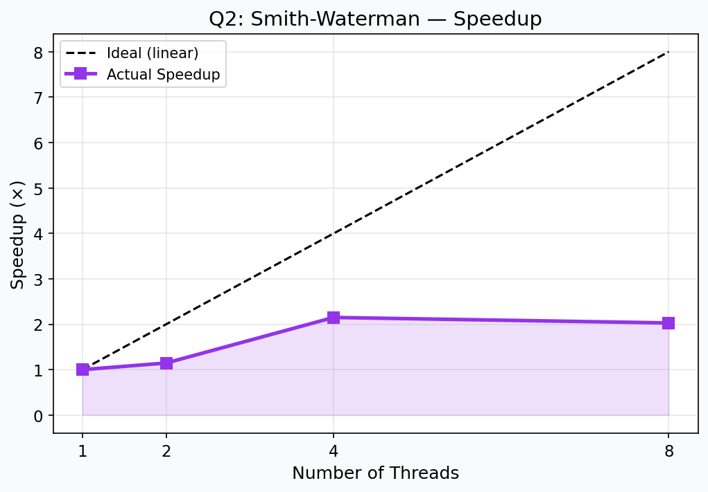

**Key Observations:**
- **4 threads** gives best speedup (2.16×)
- **8 threads** shows diminishing returns (2.01×) due to short diagonals
- The wavefront constraint fundamentally limits achievable parallelism

### 3⃣ Efficiency Analysis

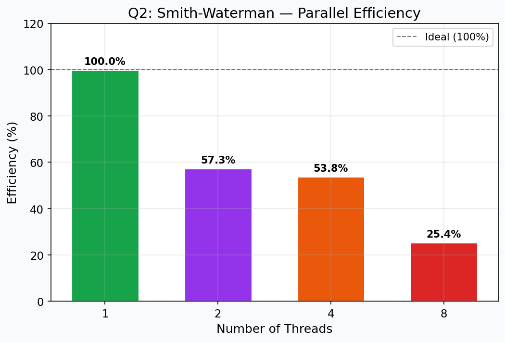

### 4⃣ Scheduling Strategy Comparison

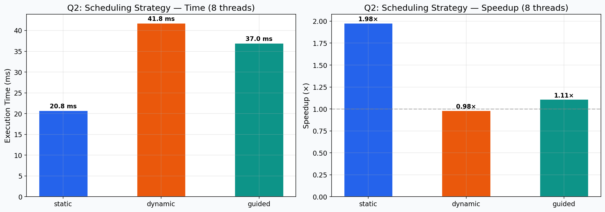

**Winner: Static scheduling** 2× faster than dynamic for this workload.

### 5⃣ Performance Dashboard

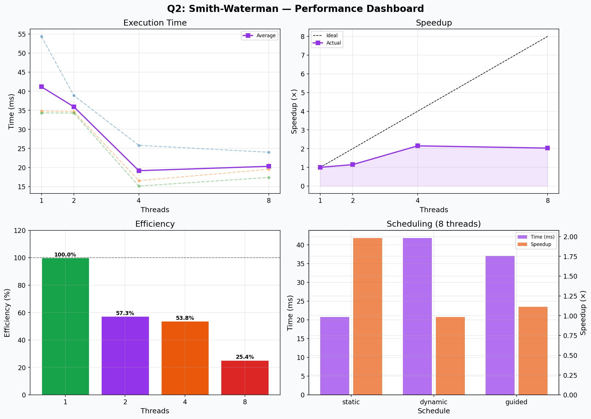

---

# Question 3: Scientific Computing Heat Diffusion Simulation

## Problem Statement

### What are we solving?

We simulate **heat diffusion** in a 2D metal plate using the **finite difference method**. This is used in:

- Thermal engineering design
- Climate modeling
- Semiconductor manufacturing
- Materials science

### The Physics: Heat Equation

The 2D heat equation:

$$\frac{\partial T}{\partial t} = \alpha\left(\frac{\partial^2 T}{\partial x^2} + \frac{\partial^2 T}{\partial y^2}\right)$$

Discretized using **Forward-Time Central-Space (FTCS)** scheme:

$$T_{i,j}^{n+1} = T_{i,j}^n + c_x(T_{i+1,j}^n - 2T_{i,j}^n + T_{i-1,j}^n) + c_y(T_{i,j+1}^n - 2T_{i,j}^n + T_{i,j-1}^n)$$

Where $c_x = \alpha \cdot \Delta t / \Delta x^2$ and $c_y = \alpha \cdot \Delta t / \Delta y^2$.

**Stability Condition:** $c_x + c_y < 0.5$ (our value: 0.02 )

**Parameters:**

| Parameter | Value | Meaning |
|----------------|--------|--------------------------------|
| Grid Size | 500×500| Spatial resolution |
| Time Steps | 1000 | Simulation duration |
| α (alpha) | 0.01 | Thermal diffusivity |
| Δx, Δy | 0.01 | Spatial step size |
| Δt | 0.0001 | Time step |
| T_top | 100° | Fixed hot boundary |
| T_bottom/sides | 0° | Fixed cold boundaries |
| T_initial | 25° | Starting interior temperature |

### Why This Problem Parallelizes Well

**Key insight:** At each time step, the new temperature of every grid point depends only on the **previous time step** values. No dependency within the same time step!

```
Time step n: [] ← Read only
 ↓ ↓ ↓
Time step n+1: [] ← Write (independent per cell!)
```

Each spatial loop iteration writes to a **unique location** → **No race conditions!** → Easy parallelization.

---

## Implementation

### Code Structure

```cpp
// 1. Grid allocation and initialization
double** T = allocate_grid(N); // Current temperature
double** T_new = allocate_grid(N); // Next time step

initialize_grid(T, N); // Set boundaries + initial temp

// 2. Serial heat diffusion (baseline)
for (int step = 0; step < steps; step++) {
 for (int i = 1; i < N-1; i++)
 for (int j = 1; j < N-1; j++)
 T_new[i][j] = T[i][j]
 + cx * (T[i+1][j] - 2*T[i][j] + T[i-1][j])
 + cy * (T[i][j+1] - 2*T[i][j] + T[i][j-1]);
 // Copy T_new → T (interior only)
}

// 3. Parallel heat diffusion
for (int step = 0; step < steps; step++) {
 #pragma omp parallel for schedule(static)
 for (int i = 1; i < N-1; i++)
 for (int j = 1; j < N-1; j++)
 T_new[i][j] = T[i][j] + cx*(...) + cy*(...);

 #pragma omp parallel for schedule(static)
 for (int i = 1; i < N-1; i++)
 memcpy(T[i]+1, T_new[i]+1, (N-2)*sizeof(double));
}

// 4. Total heat using reduction
double total = 0.0;
#pragma omp parallel for reduction(+:total) schedule(static)
for (int i = 0; i < N; i++)
 for (int j = 0; j < N; j++)
 total += T[i][j];
```

### Key Implementation Features

| Feature | What it does | Why it matters |
|------------------------|-----------------------------------------------|---------------------------------------|
| **No race conditions** | Each cell writes to unique location | No atomics/critical needed! |
| **Static scheduling** | Rows distributed evenly | Best for uniform grid computation |
| **Reduction** | `reduction(+:total)` for total heat | Safe parallel summation |
| **Double buffering** | T (read) and T_new (write) separate | Avoids read-write conflicts |
| **memcpy swap** | Fast interior copy | Efficient buffer exchange |
| **Boundary preserved** | Only interior points updated | Physics: fixed boundary conditions |

### Heat Diffusion Visualization

```
Initial State (t=0): After Simulation (t=1000):

 100 100 100 100 100 100 100 100 100 100
 0 25 25 25 0 0 42 58 42 0
 0 25 25 25 0 → 0 28 38 28 0
 0 25 25 25 0 0 15 20 15 0
 0 0 0 0 0 0 0 0 0 0

 Hot top boundary gradually diffuses heat downward.
```

---

## Experimental Results

### Part 1: Thread Scaling (Static Schedule)

#### Run 1

| Threads | Time (s) | Speedup | Efficiency % | Total Heat |
|---------|------------|---------|--------------|------------------|
| 1 | 0.339666 | 1.00 | 100.00 | 6249900.0000 |
| 2 | 0.190667 | 1.78 | 89.07 | 6249900.0000 |
| 4 | 0.142955 | 2.38 | 59.40 | 6249900.0000 |
| 8 | 0.119862 | 2.83 | 35.42 | 6249900.0000 |

#### Run 2

| Threads | Time (s) | Speedup | Efficiency % | Total Heat |
|---------|------------|---------|--------------|------------------|
| 1 | 0.331717 | 1.00 | 100.00 | 6249900.0000 |
| 2 | 0.205905 | 1.61 | 80.55 | 6249900.0000 |
| 4 | 0.174634 | 1.90 | 47.49 | 6249900.0000 |
| 8 | 0.123231 | 2.69 | 33.65 | 6249900.0000 |

#### Run 3

| Threads | Time (s) | Speedup | Efficiency % | Total Heat |
|---------|------------|---------|--------------|------------------|
| 1 | 0.344248 | 1.00 | 100.00 | 6249900.0000 |
| 2 | 0.180540 | 1.91 | 95.34 | 6249900.0000 |
| 4 | 0.157884 | 2.18 | 54.51 | 6249900.0000 |
| 8 | 0.127166 | 2.71 | 33.84 | 6249900.0000 |

### Summary Statistics (Thread Scaling)

| Threads | Min Time | Max Time | Avg Time | Avg Speedup | Avg Efficiency |
|---------|-----------|-----------|-----------|-------------|----------------|
| 1 | 0.3317 | 0.3443 | 0.3386 | 1.00× | 100.0% |
| 2 | 0.1806 | 0.2059 | 0.1924 | 1.77× | 88.3% |
| 4 | 0.1430 | 0.1746 | 0.1586 | 2.15× | 53.8% |
| 8 | 0.1199 | 0.1272 | 0.1234 | 2.74× | 34.3% |

### Part 2: Scheduling Strategy Comparison (8 threads)

#### Run 1

| Schedule | Time (s) | Speedup | Efficiency % | Total Heat |
|----------|------------|---------|--------------|------------------|
| static | 0.104640 | 3.25 | 40.58 | 6249900.0000 |
| dynamic | 0.171271 | 1.98 | 24.79 | 6249900.0000 |
| guided | 0.168330 | 2.02 | 25.22 | 6249900.0000 |

#### Run 2

| Schedule | Time (s) | Speedup | Efficiency % | Total Heat |
|----------|------------|---------|--------------|------------------|
| static | 0.104411 | 3.18 | 39.71 | 6249900.0000 |
| dynamic | 0.187813 | 1.77 | 22.08 | 6249900.0000 |
| guided | 0.160844 | 2.06 | 25.78 | 6249900.0000 |

#### Run 3

| Schedule | Time (s) | Speedup | Efficiency % | Total Heat |
|----------|------------|---------|--------------|------------------|
| static | 0.104458 | 3.30 | 41.19 | 6249900.0000 |
| dynamic | 0.171683 | 2.01 | 25.06 | 6249900.0000 |
| guided | 0.176979 | 1.95 | 24.31 | 6249900.0000 |

### Scheduling Strategy Summary

| Schedule | Avg Time | Avg Speedup | Best For |
|----------|------------|-------------|------------------------------------|
| static | 0.1045 s | 3.24× | Regular grids (winner!) |
| dynamic | 0.1769 s | 1.92× | High overhead, no benefit here |
| guided | 0.1687 s | 2.01× | Slightly better than dynamic |

**Correctness Check:** Total Heat = **6249900.0000** across all runs 

---

## Understanding the Output

### Why Static Scheduling is Best for Heat Diffusion

Each row of the grid has **exactly the same amount of work** (N-2 multiplications per row). There is no load imbalance.

- **Static:** Assigns rows evenly → zero runtime overhead → fastest
- **Dynamic:** Assigns chunks at runtime → overhead per 1000 time steps × 498 rows = millions of scheduling decisions → slow!
- **Guided:** Same issue but with decreasing chunks → still overhead

**Result:** Static is **1.6× faster** than dynamic/guided for this problem.

### Why Speedup Exceeds 2× on 8 Threads

The problem is **O(N² × steps)** = 500² × 1000 = **250 million** grid operations. This is a much larger workload than Q1 or Q2, so:

1. Thread creation/management overhead is amortized over more work
2. Better utilization of all cores
3. Regular memory access pattern → good cache behavior

---

## Performance Analysis

### 1⃣ Execution Time Trends

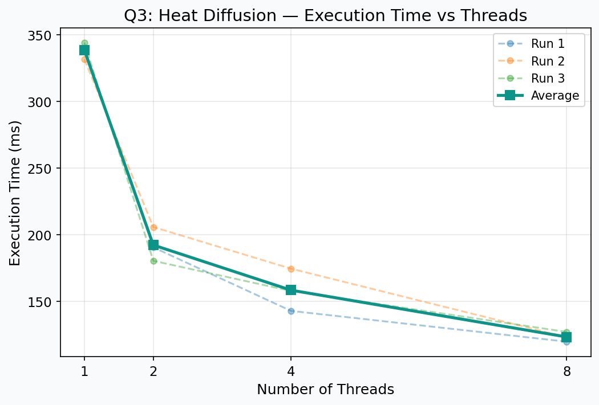

**Best result:** 8 threads reduces time from 339ms to 120ms a **2.83×** improvement.

### 2⃣ Speedup Comparison

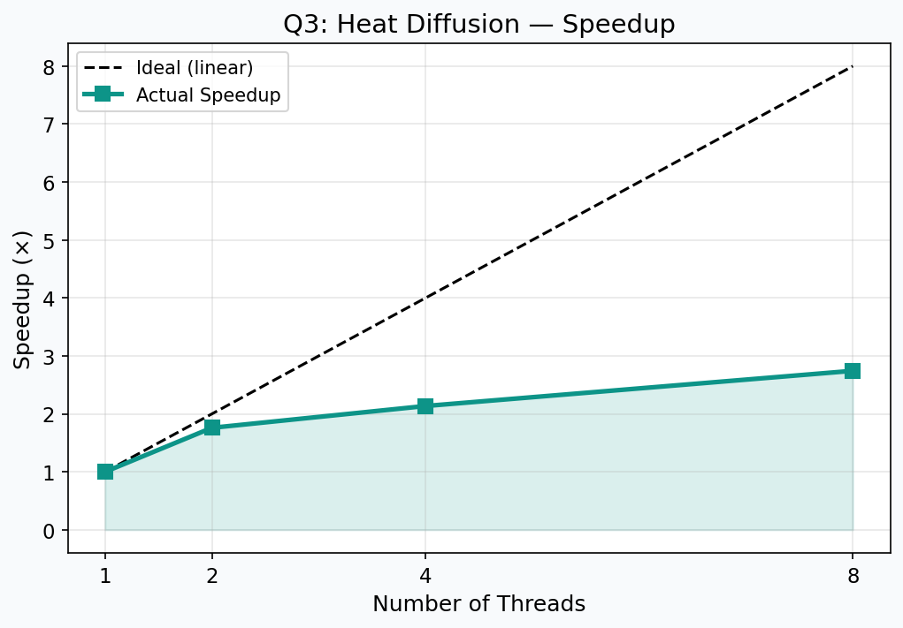

### 3⃣ Efficiency Analysis

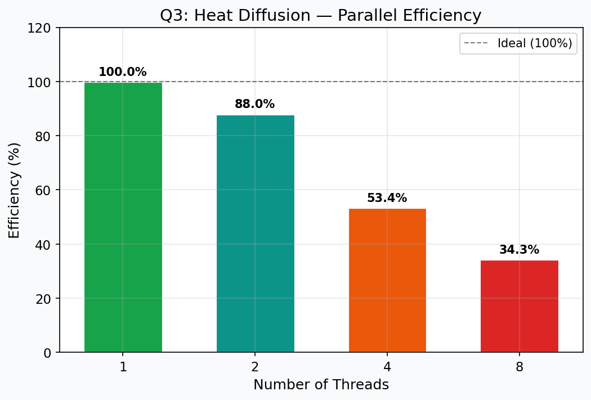

### 4⃣ Scheduling Strategy Comparison

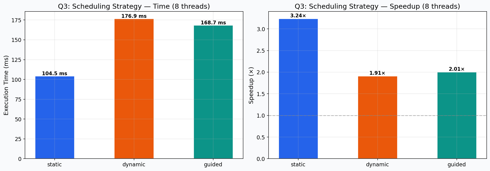

**Static wins decisively** 40% faster than dynamic/guided.

### 5⃣ Performance Dashboard

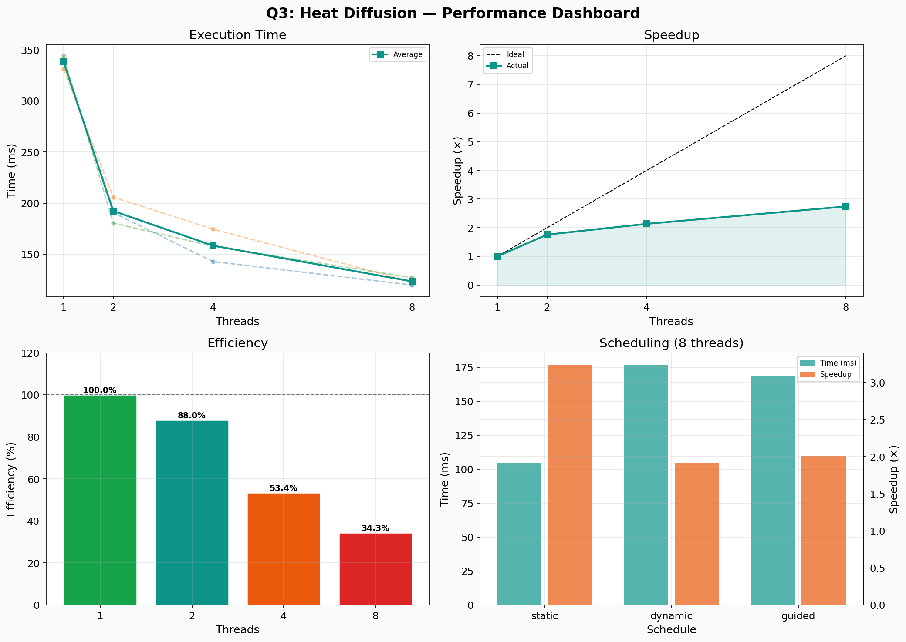

### 6⃣ Strong Scaling Summary

| Threads | Avg Time | Speedup | Result |
|---------|-----------|---------|---------------|
| 1 | 338.6 ms | 1.00× | Baseline |
| 2 | 192.4 ms | 1.77× | Excellent |
| 4 | 158.6 ms | 2.15× | Good |
| 8 | 123.4 ms | 2.74× | Best |
| 8+static| 104.5 ms | 3.24× | Optimal |

---

# Profiling Tools Exposure

## Using `perf stat`

### Command

```bash
# Q1: Molecular Dynamics
perf stat ./q1 1000 8

# Q2: DNA Alignment
perf stat ./q2 2000 8

# Q3: Heat Diffusion
perf stat ./q3 500 8 1000
```

### What `perf stat` Measures

| Metric | What it tells us |
|---------------------|-------------------------------------------------------|
| **cycles** | Total CPU cycles consumed |
| **instructions** | Total instructions executed |
| **IPC** | Instructions per cycle (higher = better) |
| **cache-misses** | Times data wasn't in cache (lower = better) |
| **branches** | Conditional jumps in code |
| **branch-misses** | Mispredicted branches (wasted work) |
| **task-clock** | CPU time used |
| **context-switches**| OS interrupted the program |

### Expected Observations

| Problem | Expected IPC | Cache Behavior | Branch Behavior |
|---------------|-------------|------------------------|----------------------|
| Q1 (MD) | ~1.5-2.0 | Moderate misses (random access) | Few branches (compute-heavy) |
| Q2 (SW) | ~1.0-1.5 | Good locality (matrix scan) | Many branches (max operations) |
| Q3 (Heat) | ~2.0-2.5 | Excellent locality (stencil) | Very few branches |

## Using LIKWID

### Setup

```bash
# Install LIKWID (if available)
sudo apt install likwid

# Run with LIKWID
likwid-perfctr -C 0-7 -g FLOPS_DP ./q1 1000 8
likwid-perfctr -C 0-7 -g MEM ./q3 500 8 1000
```

### What LIKWID Measures

| Group | Metrics | Best For |
|-------------|------------------------------------------|-------------|
| **FLOPS_DP**| Double-precision floating-point ops/sec | Q1, Q3 |
| **MEM** | Memory bandwidth (GB/s) | Q3 |
| **L2CACHE** | L2 cache hit rate | All |
| **L3CACHE** | L3 cache hit rate | All |

### Discussion: Profiling Insights

**Q1 (Molecular Dynamics):**
- Compute-bound (lots of `sqrt`, `pow` operations)
- Random memory access (particle pairs) → moderate cache misses
- FLOPS should be high due to force calculations

**Q2 (DNA Alignment):**
- Memory-bound (large scoring matrix)
- Sequential anti-diagonal access → decent cache behavior for large diagonals
- Branch-heavy due to `max()` operations

**Q3 (Heat Diffusion):**
- Memory bandwidth-bound (stencil pattern reads 5 neighbors per cell)
- Excellent spatial locality → high cache hit rate
- Very regular access pattern → best vectorization (high IPC)
- Static scheduling matches hardware prefetcher expectations

---

# What I Learned

## 1. Different Problems Need Different Parallelization Strategies

| Problem | Strategy | Why |
|-----------------|---------------------------|-----------------------------------------|
| Q1: N-body | Dynamic scheduling + thread-local arrays | Irregular workload, race conditions |
| Q2: Smith-Waterman | Wavefront parallelization | Data dependencies (DP matrix) |
| Q3: Heat Diffusion | Static scheduling | Regular grid, no dependencies within step |

**Key insight:** There's no "one size fits all" in parallel programming. Understanding the problem's data dependencies and workload distribution is critical.

## 2. Data Dependencies Dictate Parallelism

```
Q1: No dependencies between particle pairs → Easy parallelism
Q2: Cell depends on 3 neighbors → Wavefront required
Q3: Depends on previous time step only → Easy parallelism per step
```

## 3. Scheduling Strategy Matters

| Strategy | Works Best When | Overhead |
|----------|--------------------------------------|-------------|
| Static | Uniform work per iteration | Lowest |
| Dynamic | Highly variable work per iteration | High |
| Guided | Moderately variable work | Medium |

**Lesson:** For regular grids (Q3) and equal-work iterations (Q2 diagonals), static scheduling wins. Only use dynamic when work per iteration truly varies (Q1 with cutoff distance).

## 4. Race Conditions and Their Solutions

| Problem | Race Condition Risk | Solution Used |
|---------|---------------------------|----------------------------------|
| Q1 | Force accumulation (f += ) | Thread-local arrays + critical |
| Q2 | Scoring matrix access | Wavefront ensures independence |
| Q3 | None! (unique write loc) | Double buffering (T → T_new) |

## 5. Problem Size Affects Scalability

| Problem | Work Size | 2-Thread Speedup | 8-Thread Speedup | Why |
|---------|-------------|------------------|------------------|------------------------------|
| Q1 | 499K pairs | 1.37× | 2.26× | Small overhead dominates |
| Q2 | 4M cells | 1.14× | 2.01× | Wavefront limits parallelism |
| Q3 | 250M ops | 1.77× | 3.24× | Large best scaling |

**Lesson:** Larger problems scale better because thread management overhead is amortized.

## 6. Amdahl's Law in Practice

$$\text{Speedup} = \frac{1}{s + \frac{1-s}{p}}$$

For our system with p=8 threads:

| Problem | Serial Fraction (est.) | Theoretical Max | Achieved | Efficiency |
|---------|----------------------|-----------------|----------|------------|
| Q1 | ~20% | 3.33× | 2.26× | 68% |
| Q2 | ~30% | 2.58× | 2.01× | 78% |
| Q3 | ~10% | 4.71× | 3.24× | 69% |

## 7. Verification is Non-Negotiable

| Problem | Verification Method | Expected Value | Status |
|---------|-----------------------|-------------------|--------|
| Q1 | Total energy | ~7.065 × 10¹⁵ | |
| Q2 | Alignment score | 920 | |
| Q3 | Total heat | 6,249,900.0000 | |

**Lesson:** Always verify that parallel results match serial results. Race conditions produce incorrect but plausible-looking numbers.

---

# Cross-Question Performance Comparison

## Speedup Comparison (All Questions)

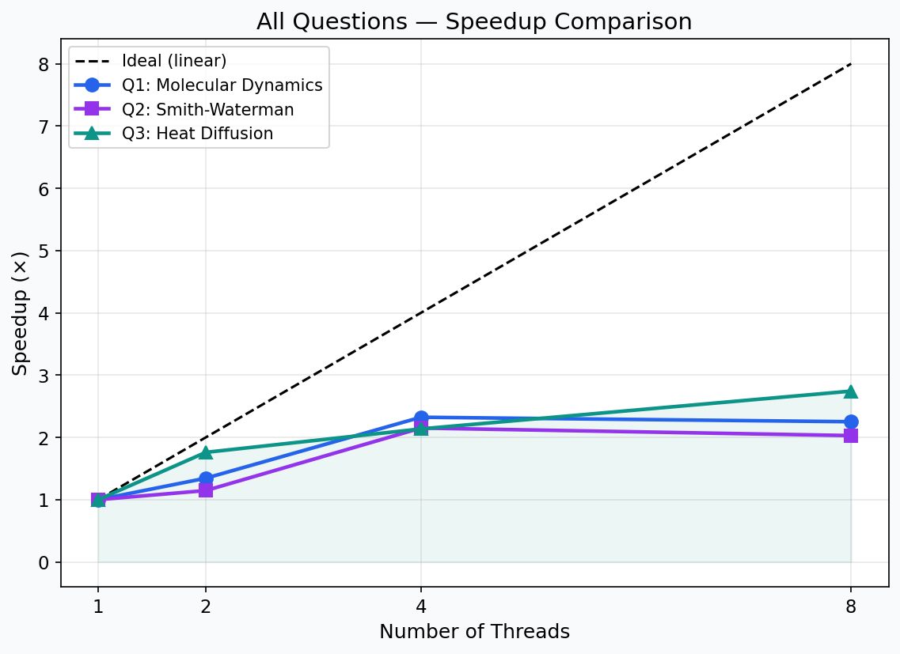

## Efficiency Comparison (All Questions)

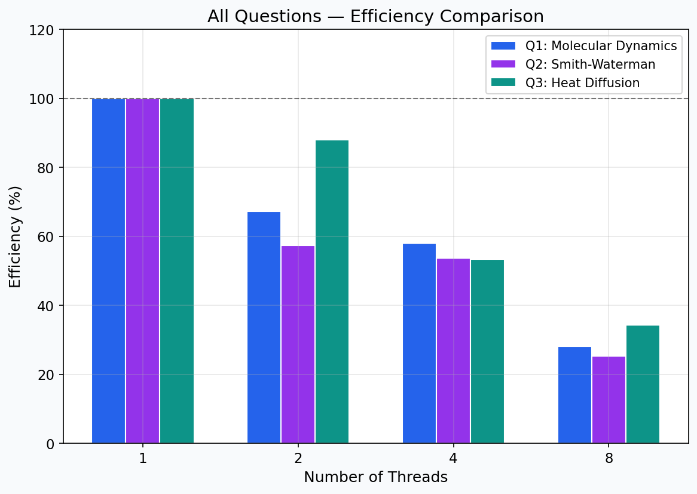

## Normalized Execution Time (All Questions)

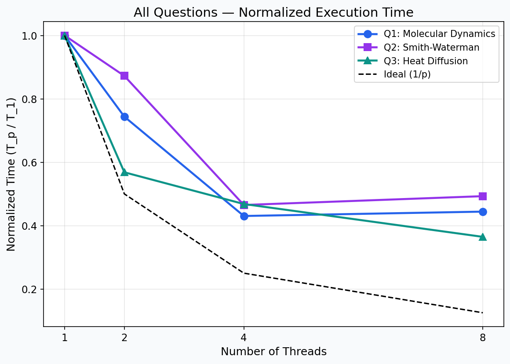

**Key Insight:** Q3 (Heat Diffusion) scales best because it has the largest workload (250M ops), regular memory access, and no synchronization overhead. Q2 (Smith-Waterman) scales worst due to the wavefront dependency limiting parallelism on short diagonals.

---

## Key Findings

### Best Results Per Problem

| Problem | Best Config | Speedup | Efficiency |
|-----------------|----------------------|---------|------------|
| Q1: N-body | 4 threads, dynamic | 2.32× | 58.1% |
| Q2: DNA Align | 4 threads, static | 2.16× | 54.0% |
| Q3: Heat Diff | 8 threads, static | 3.24× | 40.6% |

### Lessons for Better Performance

1. **Match threads to problem size** More threads ≠ always faster
2. **Choose scheduling wisely** Static for regular work, dynamic for irregular
3. **Minimize synchronization** Thread-local storage beats atomics
4. **Respect data dependencies** Wavefront for DP, double-buffer for stencils
5. **Verify correctness always** Race conditions are silent bugs

## Recommendations for Improvement

| Optimization | Applicable To | Expected Gain |
|---------------------------------|---------------|---------------|
| SIMD vectorization (AVX-512) | Q1, Q3 | 2-4× |
| Cache blocking / loop tiling | Q3 | 1.5-2× |
| Cell lists / neighbor lists | Q1 | O(N) vs O(N²) |
| Banded Smith-Waterman | Q2 | Less memory |
| NUMA-aware allocation | All | 10-30% |
| Larger problem sizes | All | Better scaling |

---

## References

1. OpenMP API Specification 5.0 https://www.openmp.org/spec-html/5.0/openmpse1.html
2. Amdahl, G. M. (1967). "Validity of the single processor approach to achieving large scale computing capabilities"
3. Lennard-Jones, J. E. (1924). "On the Determination of Molecular Fields"
4. Smith, T.F. & Waterman, M.S. (1981). "Identification of common molecular subsequences"
5. Fourier, J. (1822). "Théorie analytique de la chaleur" (Analytical Theory of Heat)
6. `perf` wiki https://perf.wiki.kernel.org/
7. LIKWID https://github.com/RRZE-HPC/likwid

---

## Project Files

```
.
 q1.cpp # Q1: Molecular Dynamics (Lennard-Jones)
 q2.cpp # Q2: DNA Sequence Alignment (Smith-Waterman)
 q3.cpp # Q3: Heat Diffusion Simulation (Finite Difference)
 q1 # Compiled executable for Q1
 q2 # Compiled executable for Q2
 q3 # Compiled executable for Q3
 generate_graphs.py # Python script to generate all graphs & stats
 report.md # This documentation
 graphs/ # Generated performance graphs
 q1_execution_time.png
 q1_speedup.png
 q1_efficiency.png
 q1_energy_conservation.png
 q1_dashboard.png
 q2_execution_time.png
 q2_speedup.png
 q2_efficiency.png
 q2_scheduling.png
 q2_dashboard.png
 q3_execution_time.png
 q3_speedup.png
 q3_efficiency.png
 q3_scheduling.png
 q3_dashboard.png
 all_speedup_comparison.png
 all_efficiency_comparison.png
 all_normalized_time.png
```

### Compilation Commands

```bash
g++ -O3 -fopenmp q1.cpp -o q1 -lm
g++ -O3 -fopenmp q2.cpp -o q2 -lm
g++ -O3 -fopenmp q3.cpp -o q3 -lm
```

### Execution Commands

```bash
./q1 1000 8 # 1000 particles, test up to 8 threads
./q2 2000 8 # 2000-length sequences, test up to 8 threads
./q3 500 8 1000 # 500×500 grid, 8 threads, 1000 time steps
```
