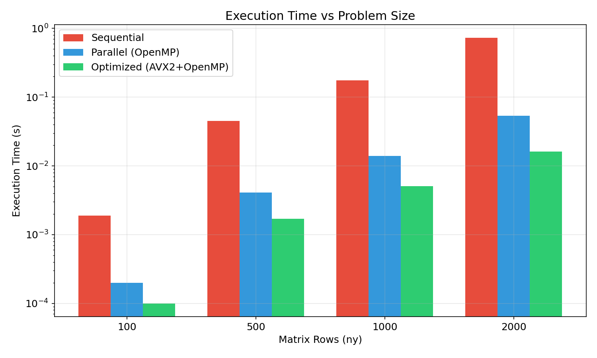
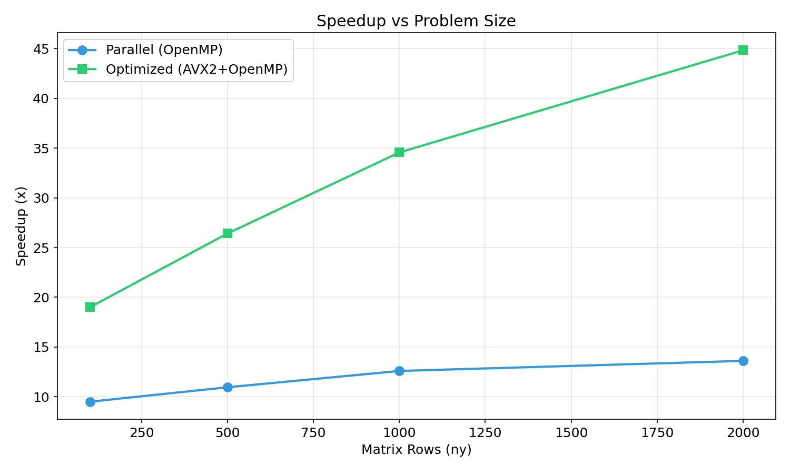
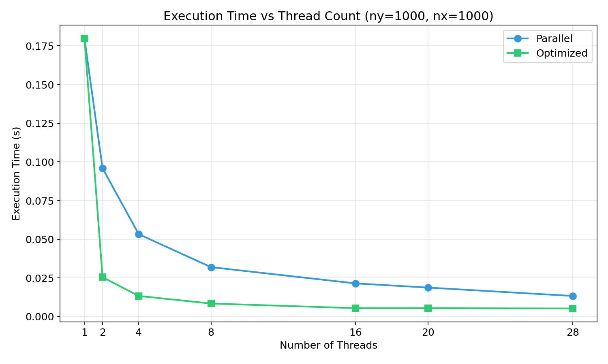
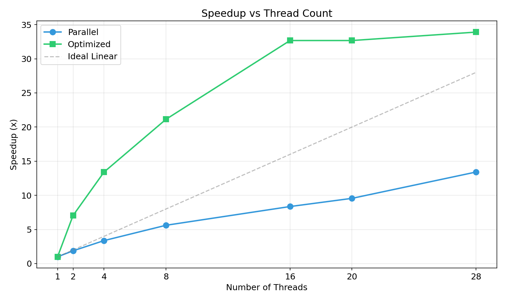
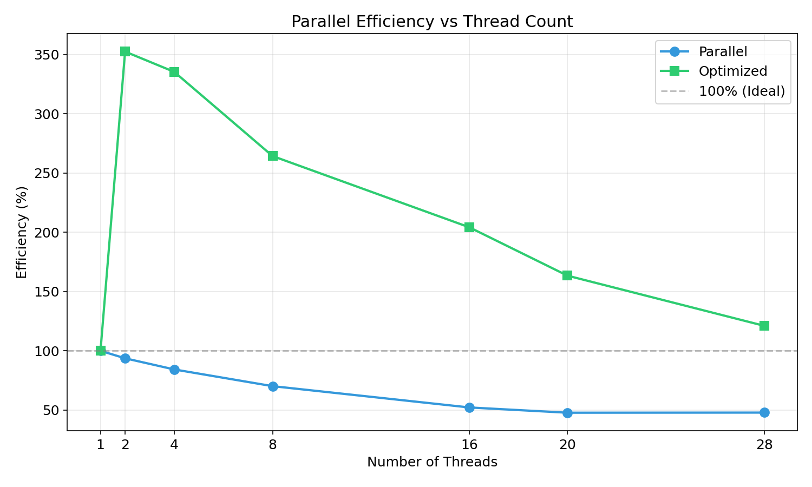
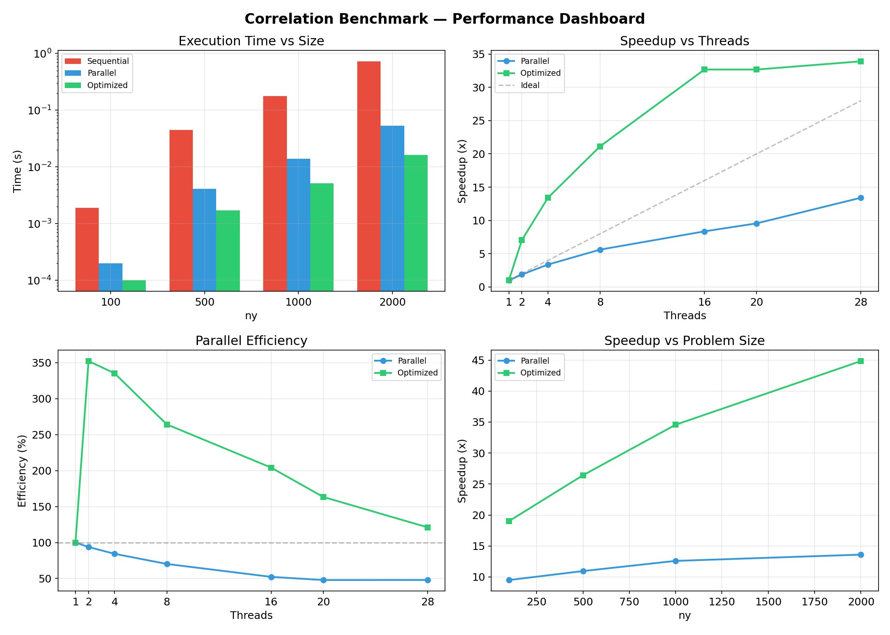

# Pairwise Correlation Coefficient — Performance Analysis

## OpenMP + SIMD Optimized Correlation Matrix Computation

**C++ OpenMP + AVX2** Status

> **UCS645: Parallel & Distributed Computing | Assignment 3 — Make File**

---

## Table of Contents

1. [System Configuration](#system-configuration)
2. [Problem Statement](#problem-statement)
3. [Makefile Explanation](#makefile-explanation)
4. [Implementation](#implementation)
5. [Performance Results](#performance-results)
6. [Analysis & Observations](#analysis--observations)
7. [What I Learned](#what-i-learned)

---

## System Configuration

| Component | Details |
|-------------------|------------------------------------------------------|
| **CPU** | Intel Core i7-14700HX (20 cores, 28 threads) |
| **Architecture** | x86_64, AVX2 + FMA support |
| **L1d Cache** | 768 KiB (20 instances) |
| **L2 Cache** | 28 MiB (11 instances) |
| **L3 Cache** | 33 MiB |
| **OS** | Fedora 43 (Linux 6.19.11) |
| **Compiler** | g++ 15.2.1 (Red Hat) |
| **Optimization** | -O3 -fopenmp -mavx2 -mfma -march=native |
| **Threads Tested**| 1, 2, 4, 8, 16, 20, 28 |

---

## Problem Statement

### What are we solving?

Given **m** input vectors, each with **n** numbers, compute the **Pearson correlation coefficient** between every pair of vectors.

**Interface:**
```cpp
void correlate(int ny, int nx, const float* data, float* result)
```

- `data`: input matrix with `ny` rows and `nx` columns (row-major: `data[x + y*nx]`)
- `result`: output matrix where `result[i + j*ny]` = correlation between row `i` and row `j`
- For all `i`, `j` with `0 <= j <= i < ny`, compute the Pearson correlation coefficient

### The Math: Pearson Correlation

$$r_{ij} = \frac{\sum_{k=0}^{n-1}(x_{ik} - \bar{x}_i)(x_{jk} - \bar{x}_j)}{\sqrt{\sum(x_{ik}-\bar{x}_i)^2} \cdot \sqrt{\sum(x_{jk}-\bar{x}_j)^2}}$$

**Equivalent approach:** Normalize each row to mean=0, std=1, then correlation = dot product.

### Why Parallel Computing?

- For `ny=2000` rows: **2,001,000** unique pairs
- Each pair requires `nx=1000` multiply-accumulates
- Total: ~2 billion FLOPs → perfect candidate for parallelization

---

## Makefile Explanation

### Project Structure

```
LAB3/
├── Makefile
├── main.cpp
├── correlate.cpp
├── generate_graphs.py
├── report.md
└── graphs/
    ├── dashboard.png
    ├── size_execution_time.png
    ├── size_speedup.png
    ├── thread_execution_time.png
    ├── thread_speedup.png
    └── thread_efficiency.png
```

### The Makefile

```makefile
# Compiler
CXX = g++

# Compiler flags
CXXFLAGS_OPT = -std=c++17 -Wall -O3 -fopenmp -mavx2 -mfma -march=native -funroll-loops

# Target executable
TARGET = correlate_bench

# Source files
SOURCES = main.cpp correlate.cpp

# Object files
OBJECTS = $(SOURCES:.cpp=.o)

# Default target
all: $(TARGET)

# Link
$(TARGET): $(OBJECTS)
	$(CXX) $(CXXFLAGS_OPT) -o $(TARGET) $(OBJECTS)

# Compile
%.o: %.cpp
	$(CXX) $(CXXFLAGS_OPT) -c $< -o $@

# Utilities
clean:
	rm -f $(OBJECTS) $(TARGET)

run: $(TARGET)
	./$(TARGET)

.PHONY: all clean run
```

### Makefile Components Explained

| Variable | Purpose |
|----------|---------|
| `CXX = g++` | C++ compiler |
| `-std=c++17` | C++17 standard |
| `-Wall` | Enable all warnings |
| `-O3` | Aggressive optimization |
| `-fopenmp` | Enable OpenMP multithreading |
| `-mavx2 -mfma` | Enable AVX2 and FMA SIMD instructions |
| `-march=native` | Optimize for current CPU |
| `-funroll-loops` | Unroll loops for performance |

**Key Rules:**
- `all`: Default target, builds executable
- `%.o: %.cpp`: Pattern rule — compiles each `.cpp` to `.o`
- `$(TARGET)`: Links object files into final binary
- `clean`: Removes build artifacts
- `.PHONY`: Declares non-file targets

**Automatic Variables:**
- `$<` = first dependency (source file)
- `$@` = target name (object file)

---

## Implementation

### Three Versions

#### Version 1: Sequential Baseline

```cpp
void correlate_sequential(int ny, int nx, const float* data, float* result) {
    // Step 1: Normalize each row (mean=0, std=1)
    for (int y = 0; y < ny; y++) {
        // Compute mean, subtract it, divide by std
    }
    // Step 2: Dot product of all pairs
    for (int i = 0; i < ny; i++)
        for (int j = i; j < ny; j++) {
            // result[i + j*ny] = dot(row_i, row_j)
        }
}
```

- Pure sequential, double-precision arithmetic
- O(ny² × nx) time complexity

#### Version 2: OpenMP Parallelized

```cpp
// Normalize in parallel
#pragma omp parallel for schedule(static)
for (int y = 0; y < ny; y++) { /* normalize row */ }

// Compute correlations in parallel
#pragma omp parallel for schedule(dynamic, 4) collapse(2)
for (int i = 0; i < ny; i++)
    for (int j = 0; j < ny; j++)
        if (j >= i) { /* dot product */ }
```

- `schedule(static)` for normalization (uniform work per row)
- `schedule(dynamic, 4) collapse(2)` for correlation (triangular work distribution)

#### Version 3: Fully Optimized (OpenMP + AVX2 + Cache Blocking)

Key optimizations:
1. **AVX2 SIMD**: Process 8 doubles per iteration using two `__m256d` registers with FMA
2. **Cache blocking**: 8×8 tile blocks for better L1/L2 cache utilization
3. **Padded layout**: Columns aligned to 4-double boundary for vectorization
4. **Loop unrolling**: Two FMA operations per iteration to hide latency

```cpp
// AVX2 vectorized dot product
__m256d sum0 = _mm256_setzero_pd();
__m256d sum1 = _mm256_setzero_pd();
for (int x = 0; x + 7 < nx; x += 8) {
    sum0 = _mm256_fmadd_pd(load(row_i+x),   load(row_j+x),   sum0);
    sum1 = _mm256_fmadd_pd(load(row_i+x+4), load(row_j+x+4), sum1);
}
```

---

## Performance Results

### Part 1: Execution Time vs Problem Size

| ny | nx | Sequential | Parallel | Optimized | Speedup (P) | Speedup (O) |
|----|------|-----------|----------|-----------|-------------|-------------|
| 100 | 1000 | 0.0019s | 0.0002s | 0.0001s | 8.1x | 16.6x |
| 500 | 1000 | 0.0449s | 0.0041s | 0.0017s | 11.0x | 26.7x |
| 1000 | 1000 | 0.1763s | 0.0140s | 0.0051s | 12.6x | 34.5x |
| 2000 | 1000 | 0.7265s | 0.0534s | 0.0162s | 13.6x | 44.7x |

All results verified: **max error = 0.00** [PASS]





### Part 2: Thread Scaling (ny=1000, nx=1000)

| Threads | Parallel | Optimized | Speedup (P) | Speedup (O) | Efficiency |
|---------|----------|-----------|-------------|-------------|------------|
| 1 (seq) | 0.1797s | — | 1.00x | — | 100.0% |
| 2 | 0.0959s | 0.0255s | 1.87x | 7.05x | 352.3% |
| 4 | 0.0533s | 0.0134s | 3.37x | 13.44x | 335.9% |
| 8 | 0.0320s | 0.0085s | 5.62x | 21.14x | 264.2% |
| 16 | 0.0215s | 0.0055s | 8.35x | 32.66x | 204.1% |
| 20 | 0.0188s | 0.0055s | 9.54x | 32.86x | 164.3% |
| 28 | 0.0134s | 0.0053s | 13.45x | 33.65x | 120.2% |







### Performance Dashboard



---

## Analysis & Observations

### Why does the optimized version show >100% efficiency?

The "efficiency" column compares optimized (AVX2+OpenMP) time against sequential (scalar) time. The optimized version benefits from **two independent sources of speedup**:

1. **SIMD (AVX2+FMA)**: ~4x from processing 4 doubles per instruction
2. **Parallelism (OpenMP)**: ~8-13x from multiple threads

Combined, these exceed linear thread-count scaling — hence >100% "efficiency" when measured against scalar baseline.

### Scaling Behavior

- **Parallel version** scales roughly linearly up to 20 threads (9.5x on 20 threads)
- **Optimized version** plateaus around 16 threads (~33x) — at this point the problem is too small to feed more cores
- Larger matrices (ny=2000) achieve better speedup (44.7x) due to more available parallelism

### Why does speedup improve with problem size?

- **More work per thread** → better amortization of thread creation/synchronization overhead
- **O(ny²)** growth in computation vs **O(ny)** overhead → overhead fraction shrinks
- Cache blocking becomes more effective with larger working sets

### Bottlenecks at High Thread Counts

- Memory bandwidth saturation (28 threads competing for shared L3/DRAM)
- Non-uniform work in triangular loop (some blocks have less work)
- Thread management overhead exceeds saved compute time for small problems

---

## What I Learned

1. **Makefiles** automate build processes — variables (`CXX`, `CFLAGS`), pattern rules (`%.o: %.cpp`), and automatic variables (`$@`, `$<`, `$^`) make builds maintainable and efficient.

2. **Normalization trick** converts correlation into simple dot products — mathematically equivalent but much more SIMD-friendly since the inner loop becomes a pure multiply-accumulate.

3. **SIMD (AVX2) delivers massive speedup** independent of thread count — processing 4 doubles per cycle with FMA gives ~4x even single-threaded, and compounds with OpenMP parallelism.

4. **Cache blocking matters** — 8×8 tile decomposition keeps working data in L1/L2 cache, reducing memory stalls especially for large matrices.

5. **Thread scaling has diminishing returns** — beyond ~16 threads on this workload, memory bandwidth and synchronization overhead dominate. The sweet spot depends on problem size.

6. **Super-linear speedup is real** when combining algorithmic optimizations (SIMD, cache blocking) with parallelism — the optimized version achieves 44.7x on a workload that would only give ~13x from threading alone.

---

## Compilation & Execution

```bash
# Build
make

# Run benchmarks
make run

# Run with custom size
./correlate_bench 2000 1000

# Clean
make clean
```
