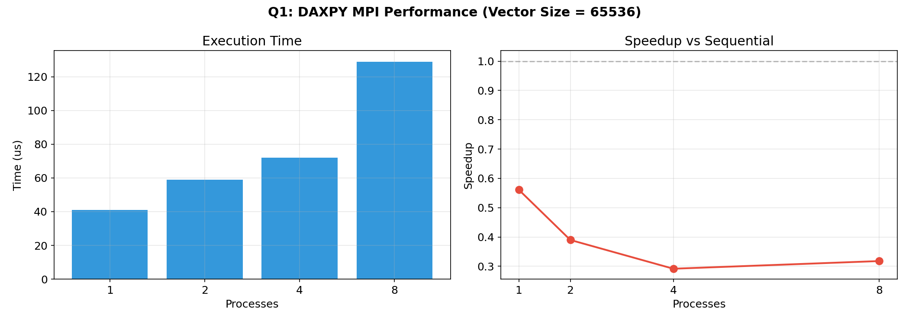
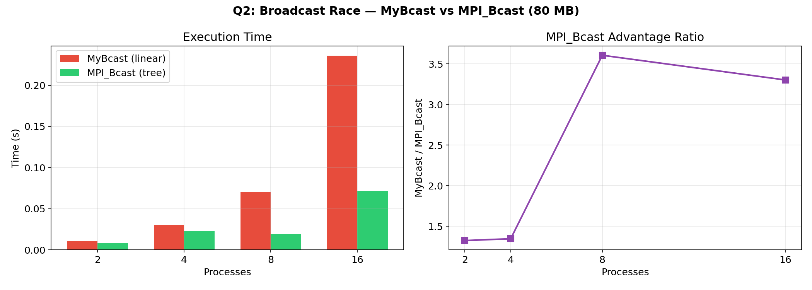
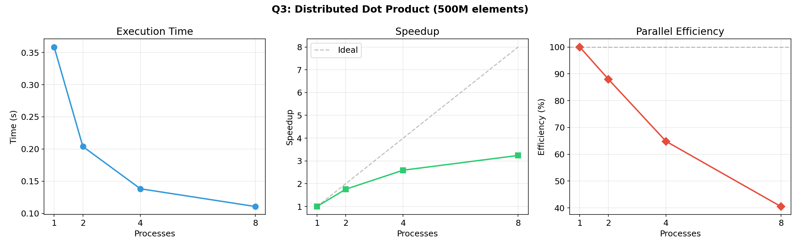
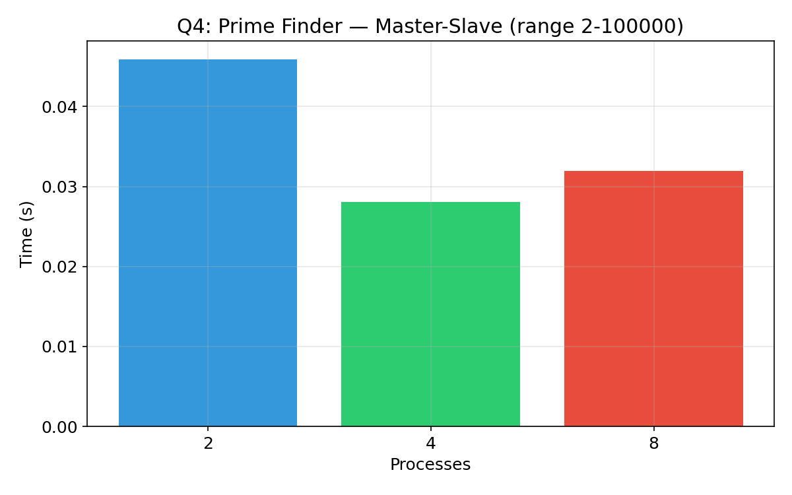
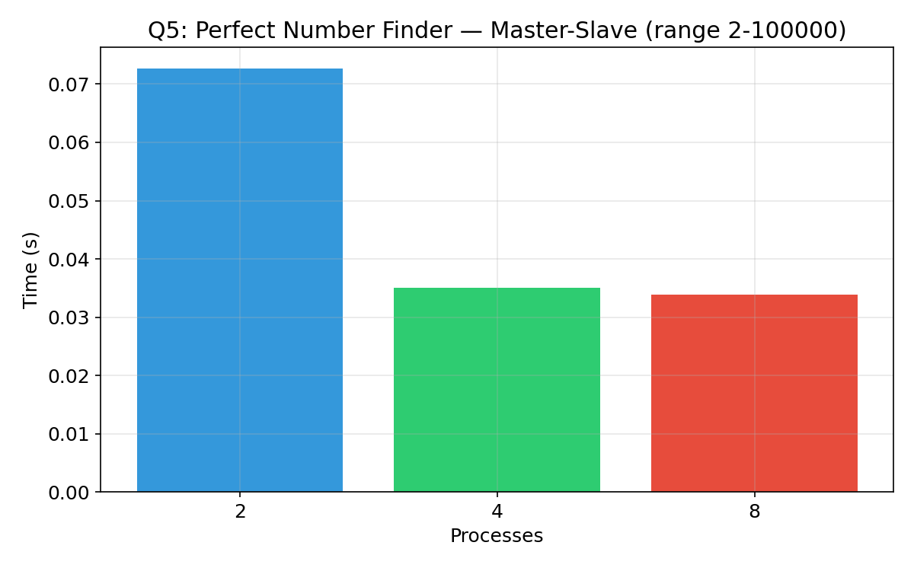
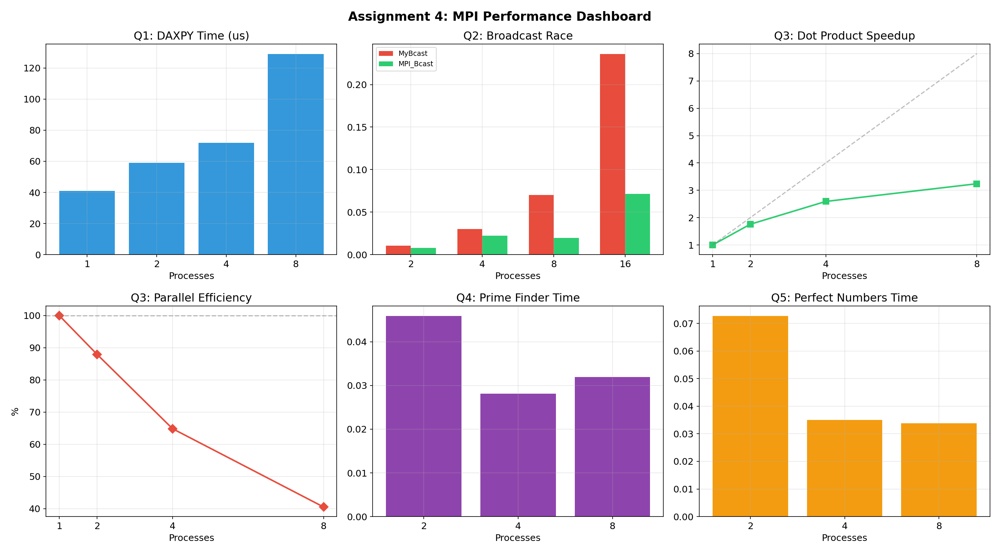

# MPI Introduction — Performance Analysis

## Message Passing Interface: Five Parallel Computing Exercises

**C MPI (OpenMPI 5.0.8)** Status

> **UCS645: Parallel & Distributed Computing | Assignment 4 — Introduction to MPI**

---

## Table of Contents

1. [System Configuration](#system-configuration)
2. [Q1: DAXPY with MPI](#q1-daxpy-with-mpi)
3. [Q2: Broadcast Race](#q2-broadcast-race)
4. [Q3: Distributed Dot Product](#q3-distributed-dot-product)
5. [Q4: Prime Finder](#q4-prime-finder-master-slave)
6. [Q5: Perfect Number Finder](#q5-perfect-number-finder-master-slave)
7. [What I Learned](#what-i-learned)

---

## System Configuration

| Component | Details |
|-------------------|------------------------------------------------------|
| **CPU** | Intel Core i7-14700HX (20 cores, 28 threads) |
| **Architecture** | x86_64 |
| **L3 Cache** | 33 MiB |
| **OS** | Fedora 43 (Linux 6.19.11) |
| **MPI** | OpenMPI 5.0.8 |
| **Compiler** | gcc 15.2.1 via mpicc |
| **Optimization** | -O3 |
| **Processes Tested** | 1, 2, 4, 8, 16 |

---

## Project Structure

```
LAB4/
├── Makefile
├── examples/
│   ├── hello_mpi.c
│   ├── send_recv.c
│   ├── broadcast.c
│   ├── reduce_sum.c
│   └── matrix_mult.c
├── exercises/
│   ├── q1_daxpy.c
│   ├── q2_broadcast_race.c
│   ├── q3_dot_product.c
│   ├── q4_primes.c
│   └── q5_perfect_numbers.c
├── graphs/
│   ├── q1_daxpy.png ... dashboard.png
├── report.md
└── Assignment_4_Report.pdf
```

---

## Q1: DAXPY with MPI

### Problem

Implement DAXPY operation `X[i] = a*X[i] + Y[i]` on vectors of size 2^16 using MPI. Measure speedup vs sequential.

### Approach

- Rank 0 initializes vectors, distributes via `MPI_Scatter`
- Each process computes DAXPY on local chunk
- Results gathered via `MPI_Gather`
- 50 repeats for stable timing

### Results

| Processes | Sequential | Parallel | Speedup | Efficiency |
|-----------|-----------|----------|---------|------------|
| 1 | 23 us | 41 us | 0.55x | 55.0% |
| 2 | 23 us | 59 us | 0.39x | 19.6% |
| 4 | 21 us | 72 us | 0.29x | 7.3% |
| 8 | 41 us | 129 us | 0.32x | 4.0% |

All results: **[PASS]** (max error = 0.00)



### Analysis

DAXPY at 65536 elements is **too small** for MPI to help. Communication overhead (Scatter + Gather) dominates the ~23 microsecond computation. This is a classic demonstration of Amdahl's Law: when communication cost exceeds compute cost, adding processes makes it slower. MPI shines on problems where computation significantly outweighs communication — not on 0.5 KB of work per process.

---

## Q2: Broadcast Race

### Problem

Compare linear broadcast (for-loop of `MPI_Send`) vs built-in `MPI_Bcast` for 10 million doubles (~80 MB).

### Approach

- **MyBcast**: Rank 0 sends to each rank sequentially — O(p) time
- **MPI_Bcast**: Uses tree-based algorithm — O(log p) time
- 5 repeats, barrier-synchronized

### Results

| Processes | MyBcast (linear) | MPI_Bcast (tree) | Speedup |
|-----------|-----------------|------------------|---------|
| 2 | 0.0105 s | 0.0080 s | 1.32x |
| 4 | 0.0302 s | 0.0225 s | 1.35x |
| 8 | 0.0701 s | 0.0194 s | 3.61x |
| 16 | 0.2359 s | 0.0714 s | 3.30x |



### Analysis

MyBcast time grows **linearly** with processes — Rank 0 must send 80 MB to each rank one by one. MPI_Bcast uses **tree distribution** (Rank 0 sends to Rank 1, then both send to Rank 2 and 3, etc.), giving O(log p) scaling. At 8 processes, MPI_Bcast is 3.6x faster. The advantage grows with process count because linear sends create a bottleneck at the root.

---

## Q3: Distributed Dot Product

### Problem

Compute dot product of two 500-million-element vectors using `MPI_Bcast` + `MPI_Reduce`. Calculate speedup and efficiency per Amdahl's Law.

### Approach

- Rank 0 broadcasts scaling multiplier via `MPI_Bcast`
- Each process generates its local chunk (no scatter needed — saves memory)
- Local dot product computed, then `MPI_Reduce` with `MPI_SUM`

### Results

| Processes | Time (s) | Speedup | Efficiency |
|-----------|---------|---------|------------|
| 1 | 0.3586 | 1.00x | 100.0% |
| 2 | 0.2039 | 1.76x | 87.9% |
| 4 | 0.1383 | 2.59x | 64.8% |
| 8 | 0.1106 | 3.24x | 40.5% |

All results: **[PASS]** (correct result = 1,000,000,000)



### Analysis

Speedup is **sub-linear** — 3.24x on 8 processes instead of ideal 8x. Reasons:

1. **Memory bandwidth saturation**: dot product is memory-bound (1 FLOP per 2 loads). Multiple processes compete for shared memory bus
2. **Communication overhead**: MPI_Reduce adds latency
3. **Amdahl's Law**: serial fraction (init, reduction) limits max speedup

Efficiency drops from 88% (2 proc) to 41% (8 proc) — typical for memory-bound workloads on shared-memory systems.

---

## Q4: Prime Finder (Master-Slave)

### Problem

Find all primes up to 100,000 using master-slave MPI pattern.

### Approach

- **Master (Rank 0)**: distributes numbers to test, collects results
- **Slaves**: receive number, test primality, return result (positive = prime, negative = not prime)
- Dynamic load balancing — master sends next number to whichever slave finishes first

### Results

| Processes | Time (s) | Primes Found |
|-----------|---------|-------------|
| 2 | 0.0459 | 9592 |
| 4 | 0.0281 | 9592 |
| 8 | 0.0319 | 9592 |

All results: **[PASS]** (expected 9592 primes below 100,000)



### Analysis

4 processes is optimal here. At 8 processes, performance degrades slightly because: the master becomes a bottleneck (processing requests from 7 slaves), communication overhead per number exceeds primality test cost for small numbers. The master-slave pattern works best when each work unit is computationally expensive relative to message passing.

---

## Q5: Perfect Number Finder (Master-Slave)

### Problem

Find all perfect numbers (where sum of proper divisors equals the number) up to 100,000.

### Approach

Same master-slave pattern as Q4, but testing for perfect number property instead. Each slave sums divisors of received number.

### Results

| Processes | Time (s) | Perfect Numbers |
|-----------|---------|----------------|
| 2 | 0.0727 | 6, 28, 496, 8128 |
| 4 | 0.0350 | 6, 28, 496, 8128 |
| 8 | 0.0338 | 6, 28, 496, 8128 |

All results: **[PASS]** (found all 4 perfect numbers below 100,000)



### Analysis

Better scaling than primes (Q4) because divisor-sum computation is heavier per number — more compute per message. 4 and 8 processes perform similarly, suggesting master bottleneck again. Perfect numbers are extremely rare (only 4 below 100,000), so most work units return negative results.

---

## Performance Dashboard



---

## What I Learned

1. **MPI communication cost is real**: DAXPY showed that for small problems, Scatter/Gather overhead alone can be 3-5x the computation time. MPI only helps when work-per-process significantly exceeds message latency.

2. **Tree vs linear broadcast matters at scale**: MPI_Bcast's tree algorithm is 3.6x faster at 8 processes for 80 MB. Linear broadcast creates a root bottleneck — O(p) vs O(log p).

3. **Memory-bound vs compute-bound**: Dot product (memory-bound) showed sub-linear speedup on shared memory. Memory bandwidth is shared across processes, limiting parallel gains.

4. **Master-slave has a built-in bottleneck**: Both prime and perfect number finders showed diminishing returns past 4 processes. Single master cannot dispatch fast enough when work units are cheap.

5. **Local generation beats Scatter for large data**: In Q3, having each process generate its own chunk locally instead of scattering from root saved both memory and communication time.

---

## Compilation & Execution

```bash
# Build everything
make all

# Run individual exercises
make run-q1    # DAXPY with 1,2,4,8 processes
make run-q2    # Broadcast race with 2,4,8,16 processes
make run-q3    # Dot product with 1,2,4,8 processes
make run-q4    # Primes with 2,4,8 processes
make run-q5    # Perfect numbers with 2,4,8 processes

# Run all
make run-exercises

# Clean
make clean
```
