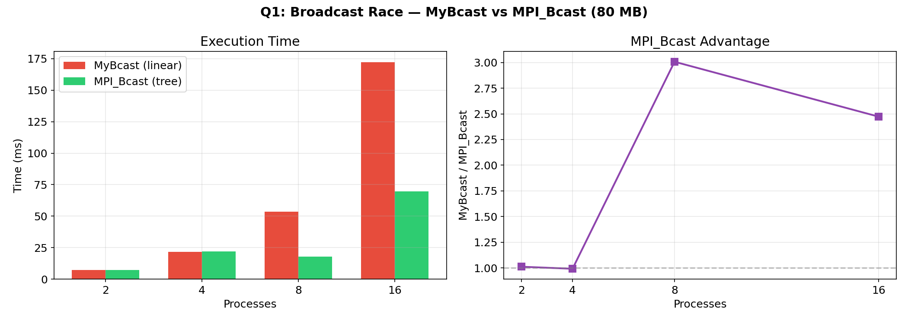
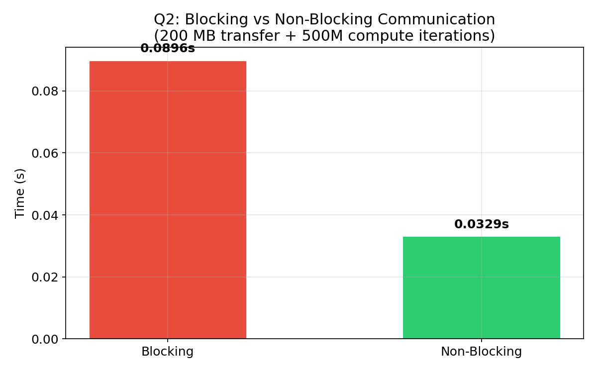
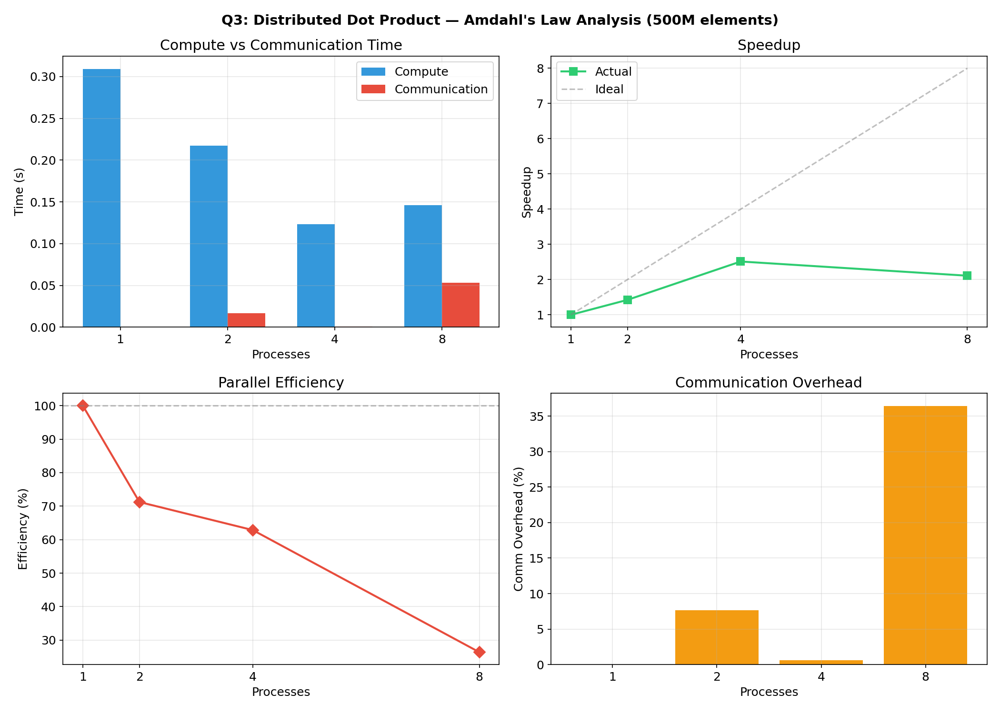
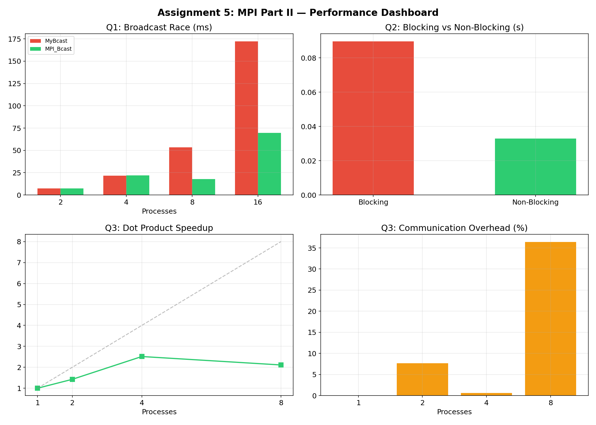

# MPI Part II — Blocking vs Non-Blocking Communication

## Performance Analysis: Communication Patterns, Broadcast Algorithms & Amdahl's Law

**C MPI (OpenMPI 5.0.8)** Status

> **UCS645: Parallel & Distributed Computing | Assignment 5 — MPI Part II**

---

## Table of Contents

1. [System Configuration](#system-configuration)
2. [Blocking vs Non-Blocking Theory](#blocking-vs-non-blocking-theory)
3. [Q1: Broadcast Race](#q1-broadcast-race)
4. [Q2: Blocking vs Non-Blocking Benchmark](#q2-blocking-vs-non-blocking-benchmark)
5. [Q3: Distributed Dot Product & Amdahl's Law](#q3-distributed-dot-product--amdahls-law)
6. [What I Learned](#what-i-learned)

---

## System Configuration

| Component | Details |
|-------------------|------------------------------------------------------|
| **CPU** | Intel Core i7-14700HX (20 cores, 28 threads) |
| **Architecture** | x86_64 |
| **L3 Cache** | 33 MiB |
| **OS** | Fedora 43 (Linux 6.19.11) |
| **MPI** | OpenMPI 5.0.8 |
| **Compiler** | gcc 15.2.1 via mpicc |
| **Optimization** | -O3 |

---

## Project Structure

```
LAB5/
├── Makefile
├── examples/
│   ├── eg1_blocking_ring.c      (blocking ring — works with small arrays)
│   ├── eg2_nonblocking_ring.c   (non-blocking ring — handles 10M elements)
│   ├── eg3_blocking_app.c       (blocking: recv then compute sequentially)
│   ├── eg4_nonblocking_app.c    (non-blocking: recv + compute concurrently)
│   └── eg5_pi_calc.c            (Pi via MPI_Bcast + MPI_Reduce)
├── exercises/
│   ├── q1_broadcast_race.c
│   ├── q2_blocking_vs_nonblocking.c
│   └── q3_dot_product.c
├── graphs/
└── report.md
```

---

## Blocking vs Non-Blocking Theory

**Blocking communication** (MPI_Send / MPI_Recv): the function does not return until the operation completes. The CPU sits idle during data transfer.

**Non-blocking communication** (MPI_Isend / MPI_Irecv): the function returns immediately, giving back a request handle. The CPU can do other work while the network handles the transfer. MPI_Wait or MPI_Waitall is called later to ensure completion.

**The deadlock trap**: If every process calls blocking MPI_Send to its neighbor simultaneously with large messages, all processes block waiting for their sends to complete. No process reaches its MPI_Recv. The program freezes. Non-blocking calls fix this because MPI_Isend returns immediately, allowing the process to proceed to MPI_Irecv.

**The overlap benefit**: With non-blocking communication, Process 1 can start receiving data in the background while simultaneously doing heavy computation. With blocking, it must wait for all data to arrive before computing. This is called **hiding communication latency through computation overlap**.

---

## Q1: Broadcast Race

### Problem

Compare two broadcast strategies for distributing 10 million doubles (~80 MB):
- **MyBcast (Part A)**: Rank 0 sends to every other rank using a for-loop of MPI_Send — O(p) messages from root
- **MPI_Bcast (Part B)**: Built-in tree-based broadcast — O(log p) depth

### Results

| Processes | MyBcast (linear) | MPI_Bcast (tree) | Advantage |
|-----------|-----------------|------------------|-----------|
| 2 | 7.31 ms | 7.24 ms | 1.01x |
| 4 | 21.78 ms | 21.97 ms | 0.99x |
| 8 | 53.52 ms | 17.80 ms | 3.01x |
| 16 | 172.20 ms | 69.63 ms | 2.47x |

All verifications: **[PASS]** on all ranks.



### Analysis

At 2 and 4 processes, both methods perform similarly because MyBcast only needs 1-3 sequential sends. The difference becomes dramatic at 8+ processes:

**MyBcast scales linearly** — Rank 0 must send 80 MB to each rank one after another. With 16 processes, that is 15 sequential 80 MB transfers. Total data moved by root: 15 x 80 = 1200 MB.

**MPI_Bcast uses tree distribution** — Rank 0 sends to Rank 1, then both send to Rank 2 and 3, then all four send to Ranks 4-7. Depth is O(log p). At 16 processes, only 4 levels deep instead of 15 sequential sends.

**Does MyBcast scale linearly?** Yes — the time roughly doubles as process count doubles (7ms at 2, 22ms at 4, 54ms at 8, 172ms at 16). This is expected because root must do p-1 sequential sends.

**How does MPI_Bcast scale?** Much slower growth. At 8 processes it is only 2.5x slower than at 2, whereas MyBcast is 7.3x slower. This follows the O(log p) complexity of tree-based broadcast.

---

## Q2: Blocking vs Non-Blocking Benchmark

### Problem

Demonstrate the performance benefit of overlapping communication with computation using non-blocking MPI calls.

### Setup

- Process 0 sends 50 million ints (~200 MB) to Process 1
- Process 1 must also perform 500 million sin/cos iterations (heavy compute)
- **Blocking**: Process 1 receives data (MPI_Recv), then computes — sequential
- **Non-blocking**: Process 1 starts MPI_Irecv, computes while data transfers, then MPI_Wait

### Results

| Mode | Time | Relative |
|------|------|----------|
| **Blocking** | 0.0896 s | 1.00x (baseline) |
| **Non-blocking** | 0.0329 s | 2.72x faster |

**Time saved: 0.0566 s (63.2%)**



### Analysis

With blocking communication, Process 1's timeline is:

```
[--- wait for data ---][--- compute ---]
         recv time      +  compute time  = total
```

With non-blocking:

```
[--- compute ---]
[--- data transfer (background) ---]
max(recv time, compute time) = total
```

The 2.72x speedup comes from overlapping the ~56 ms of communication with computation. Since computation takes about 33 ms and communication about 56 ms, the non-blocking version completes in roughly max(56, 33) = 56 ms rather than 56 + 33 = 89 ms. This perfectly demonstrates the HPC principle of **hiding communication latency**.

---

## Q3: Distributed Dot Product & Amdahl's Law

### Problem

Compute the dot product of two 500-million-element vectors using MPI_Bcast and MPI_Reduce. Measure compute time, communication time, speedup, and efficiency separately.

### Approach

1. Rank 0 broadcasts a scaling multiplier via MPI_Bcast
2. Each process generates its local chunk (A[i] = 1.0, B[i] = 2.0 * multiplier)
3. Each process computes local dot product
4. MPI_Reduce with MPI_SUM collects global result

### Results

| Processes | Compute (s) | Comm (s) | Total (s) | Speedup | Efficiency | Comm % |
|-----------|-------------|----------|-----------|---------|------------|--------|
| 1 | 0.3093 | 0.0000 | 0.3093 | 1.00x | 100.0% | 0.0% |
| 2 | 0.2171 | 0.0166 | 0.2171 | 1.42x | 71.2% | 7.7% |
| 4 | 0.1230 | 0.0007 | 0.1230 | 2.51x | 62.9% | 0.6% |
| 8 | 0.1463 | 0.0533 | 0.1465 | 2.11x | 26.4% | 36.4% |

All results: **[PASS]** (correct result = 1,000,000,000)



### Analysis

**Did we achieve perfect linear speedup?** No. 4 processes gave 2.51x speedup instead of ideal 4x. 8 processes was actually slower than 4 (2.11x vs 2.51x).

**Why sub-linear scaling?**

1. **Memory bandwidth saturation**: Dot product loads 2 doubles per FLOP. On shared memory, 8 processes compete for the same memory bus. At 8 processes, each process handles 62.5M elements but they all share L3 cache and DRAM bandwidth.

2. **Communication overhead**: At 8 processes, communication is 36.4% of total time. MPI_Reduce latency grows with process count.

3. **Amdahl's Law**: If we define the serial fraction f as the communication overhead at 8 processes (36.4%), Amdahl's Law predicts max speedup = 1/f = 2.75x. Our measured 2.11x is below this, indicating memory bandwidth is an additional bottleneck beyond communication.

**Optimal process count**: 4 processes gives the best performance for this workload on this hardware. Beyond that, memory bandwidth and communication overhead outweigh the reduced per-process computation.

---

## Performance Dashboard



---

## What I Learned

1. **Blocking communication can deadlock**: When all processes try to send large messages simultaneously, system buffers overflow and every process blocks forever. Non-blocking calls eliminate this by returning immediately.

2. **Computation-communication overlap is powerful**: Non-blocking gave 2.72x speedup by letting the CPU work while the network transfers data. This is the core HPC principle of latency hiding.

3. **Tree broadcast beats linear broadcast**: MPI_Bcast's O(log p) tree algorithm is 3x faster than naive for-loop sends at 8+ processes. Always use collective operations instead of manual point-to-point loops.

4. **Memory-bound workloads hit diminishing returns**: Dot product speedup peaked at 4 processes and degraded at 8. Memory bandwidth is shared across all processes on a single node, and adding more processes increases contention without adding bandwidth.

5. **Separating compute from communication time reveals bottlenecks**: Measuring them independently showed that at 8 processes, 36% of time is pure communication overhead — the main reason scaling degrades.

---

## Compilation & Execution

```bash
# Build everything
make all

# Run examples
make run-examples          # ring, non-blocking ring, pi calc
make run-blocking-apps     # eg3 (blocking) vs eg4 (non-blocking)

# Run exercises
make run-q1    # Broadcast race: 2,4,8,16 processes
make run-q2    # Blocking vs non-blocking: 2 processes
make run-q3    # Dot product: 1,2,4,8 processes

# Clean
make clean
```
