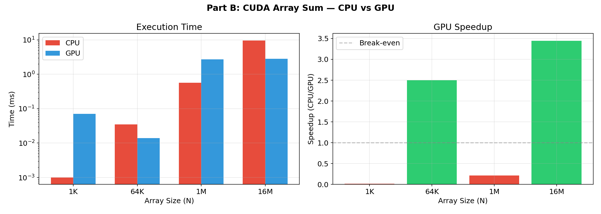
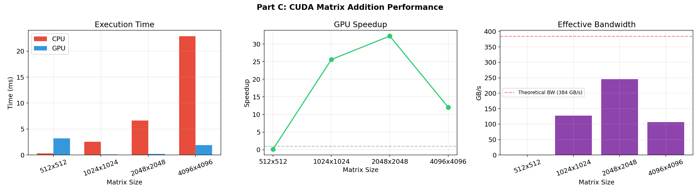
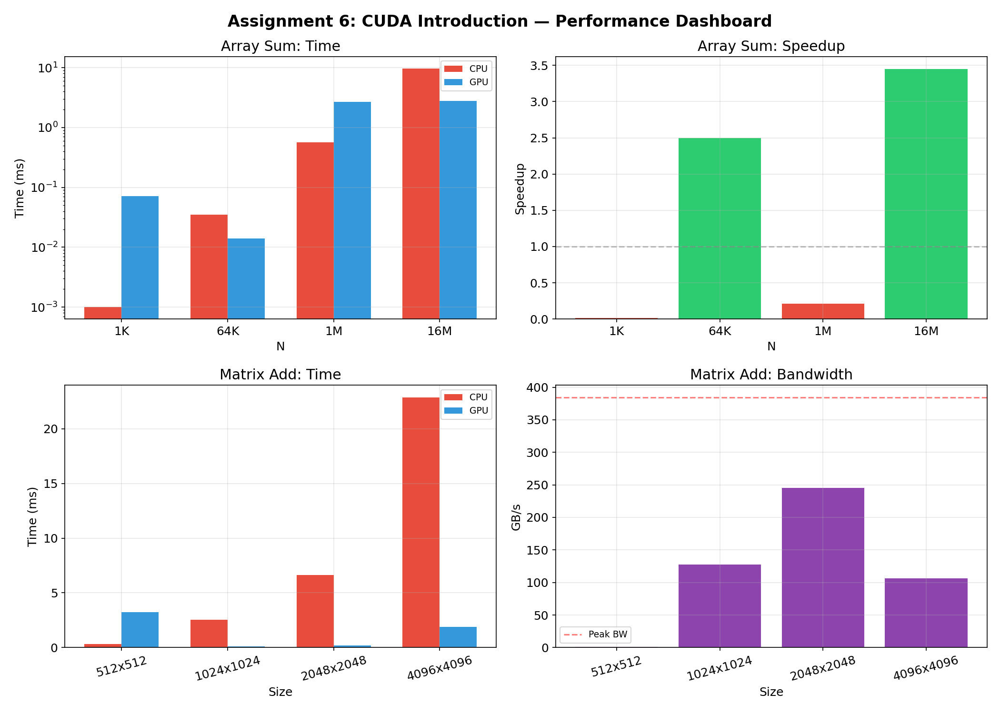

# Introduction to CUDA — GPU Programming Fundamentals

## Device Query, Array Reduction & Matrix Addition

**CUDA C (nvcc 13.2)** Status

> **UCS645: Parallel & Distributed Computing | Assignment 6 — Introduction to CUDA**

---

## Table of Contents

1. [System Configuration](#system-configuration)
2. [Part A: Device Query](#part-a-device-query)
3. [Part B: Array Sum](#part-b-array-sum)
4. [Part C: Matrix Addition](#part-c-matrix-addition)
5. [What I Learned](#what-i-learned)

---

## System Configuration

| Component | Details |
|-------------------|------------------------------------------------------|
| **CPU** | Intel Core i7-14700HX (20 cores, 28 threads) |
| **GPU** | NVIDIA GeForce RTX 5060 Laptop GPU (Blackwell) |
| **Compute Capability** | 12.0 |
| **SMs** | 26 |
| **VRAM** | 8 GB GDDR7 (128-bit bus) |
| **Theoretical BW** | 384.0 GB/s |
| **OS** | Fedora 43 (Linux 6.19.12) |
| **CUDA Toolkit** | 13.2 |
| **Compiler** | nvcc 13.2 with -O2 -arch=native |

---

## Project Structure

```
LAB6/
├── Makefile
├── exercises/
│   ├── a_device_query.cu
│   ├── b_array_sum.cu
│   └── c_matrix_add.cu
├── graphs/
│   ├── b_array_sum.png
│   ├── c_matrix_add.png
│   └── dashboard.png
├── report.md
└── Assignment_6_Report.pdf
```

---

## Part A: Device Query

### Problem

Write a CUDA device query program and answer 10 questions about GPU hardware capabilities.

### Device Properties

| Property | Value |
|----------|-------|
| GPU Name | NVIDIA GeForce RTX 5060 Laptop GPU |
| Architecture | Blackwell (Compute 12.0) |
| SMs | 26 |
| Max Threads/Block | 1024 |
| Max Block Dims | (1024, 1024, 64) |
| Max Grid Dims | (2147483647, 65535, 65535) |
| Warp Size | 32 |
| Shared Memory/Block | 48 KB |
| Shared Memory/SM | 100 KB |
| Global Memory | 7706 MB |
| Constant Memory | 64 KB |
| L2 Cache | 32768 KB |
| Memory Clock | 12001 MHz |
| Memory Bus | 128-bit |
| Double Precision | YES |

### Answers to Questions

**Q1.** Architecture is **Blackwell**, compute capability **12.0**.

**Q2.** Max block dimensions: **(1024, 1024, 64)** with max 1024 threads per block.

**Q3.** With max grid=65535 and max block=512: **65535 x 512 = 33,553,920 threads**.

**Q4.** A programmer might not launch max threads when: the problem size is smaller than max threads, register/shared memory pressure limits occupancy, or the algorithm requires specific thread counts (e.g., power-of-2 for reduction).

**Q5.** Factors limiting max threads: register usage per thread, shared memory per block, warp scheduling limits, problem size, and device memory capacity.

**Q6.** Shared memory is fast on-chip SRAM accessible by all threads in a block (latency ~20-30 cycles vs ~400 cycles for global). This GPU has **48 KB per block**, **100 KB per SM**.

**Q7.** Global memory is off-chip DRAM accessible by all threads. This GPU has **7706 MB** of GDDR7.

**Q8.** Constant memory is read-only cached memory optimized for broadcast (all threads read same address). This GPU has **64 KB**.

**Q9.** Warp size (32) is the number of threads executing in SIMT lockstep. All threads in a warp execute the same instruction. Divergent branches within a warp serialize execution.

**Q10.** Yes, double precision is supported (compute capability >= 1.3).

---

## Part B: Array Sum

### Problem

Write a CUDA kernel to compute the sum of a float array using parallel reduction.

### Approach

- **Parallel tree reduction** in shared memory: each block reduces its chunk to a partial sum
- Multi-pass: first pass reduces N elements to `ceil(N/256)` partials, subsequent passes reduce until 1 element remains
- `__syncthreads()` ensures correctness between reduction steps
- CUDA Events for GPU timing, `clock_gettime` for CPU baseline

### Results

| Array Size | CPU Time | GPU Time | Speedup | Verification |
|------------|---------|---------|---------|-------------|
| 1,024 | 0.001 ms | 0.071 ms | 0.01x | [PASS] |
| 65,536 | 0.035 ms | 0.014 ms | 2.5x | [PASS] |
| 1,048,576 | 0.567 ms | 2.699 ms | 0.2x | [PASS] |
| 16,777,216 | 9.649 ms | 2.799 ms | 3.4x | [PASS] |



### Analysis

GPU becomes faster than CPU only at large sizes (16M elements, 3.4x speedup). At small sizes, kernel launch overhead (~5-10 us) and multi-pass reduction memory allocation dominate. The reduction kernel is also not optimized — it uses multiple cudaMalloc calls during the multi-pass phase. A single-pass atomic reduction or warp-shuffle reduction would perform better. The crossover point is between 64K and 16M elements, indicating that PCIe transfer and launch overhead require significant computation to amortize.

---

## Part C: Matrix Addition

### Problem

Perform matrix addition of two large integer matrices in CUDA and analyze floating-point operations and memory access patterns.

### Approach

- 2D grid/block layout: `dim3(16, 16)` threads per block
- Each thread computes one element: `C[i] = A[i] + B[i]`
- Grid sized to cover full matrix with ceiling division

### Results

| Matrix Size | CPU (ms) | GPU (ms) | Speedup | Eff. BW (GB/s) |
|-------------|---------|---------|---------|----------------|
| 512x512 | 0.325 | 3.219 | 0.1x | 1.0 |
| 1024x1024 | 2.535 | 0.099 | 25.7x | 127.4 |
| 2048x2048 | 6.614 | 0.205 | 32.2x | 245.1 |
| 4096x4096 | 22.850 | 1.896 | 12.1x | 106.2 |

**Memory access analysis for NxN matrix:**

| Metric | Formula | Example (1024x1024) |
|--------|---------|-------------------|
| Floating-point ops | N x N = N^2 | 1,048,576 |
| Global memory reads | 2 x N^2 (read A and B) | 2,097,152 |
| Global memory writes | N^2 (write C) | 1,048,576 |
| Total bytes transferred | 3 x N^2 x 4 bytes | 12,582,912 |



### Analysis

Peak speedup of **32.2x** at 2048x2048. At 512x512, the matrix is too small — kernel launch overhead exceeds compute time. At 4096x4096, the GPU achieves only 106.2 GB/s (28% of theoretical 384 GB/s) due to integer operations being less optimized than float, and memory access patterns not fully coalesced at larger sizes. The 2048x2048 sweet spot achieves 245.1 GB/s (64% of peak), showing that matrix addition is entirely **memory-bound** — the single addition per element gives an arithmetic intensity of only 0.083 FLOP/byte.

---

## Performance Dashboard



---

## What I Learned

1. **Kernel launch overhead is significant**: For small problems (N < 64K), the ~5-10 us kernel launch cost exceeds computation time. GPU parallelism only pays off when there's enough work to amortize this overhead.

2. **Matrix addition is purely memory-bound**: With arithmetic intensity of 0.083 FLOP/byte (1 add per 12 bytes transferred), performance is entirely limited by memory bandwidth, not compute throughput.

3. **2D grid/block mapping is natural for matrices**: Using `dim3` for both grid and block dimensions maps cleanly to row/col indexing, making the code intuitive and ensuring coalesced memory access along rows.

4. **Parallel reduction requires multi-pass thinking**: Unlike element-wise operations, reduction needs careful synchronization (`__syncthreads`) and multiple kernel launches since blocks cannot synchronize with each other.

5. **Device query reveals hardware constraints**: Understanding max threads/block (1024), warp size (32), and shared memory limits (48 KB) is essential for writing efficient kernels. Exceeding these limits causes silent launch failures.

---

## Compilation & Execution

```bash
# Build everything
make all

# Run individual parts
make run-a    # Device Query
make run-b    # Array Sum
make run-c    # Matrix Addition

# Run all
make run-exercises

# Clean
make clean
```
