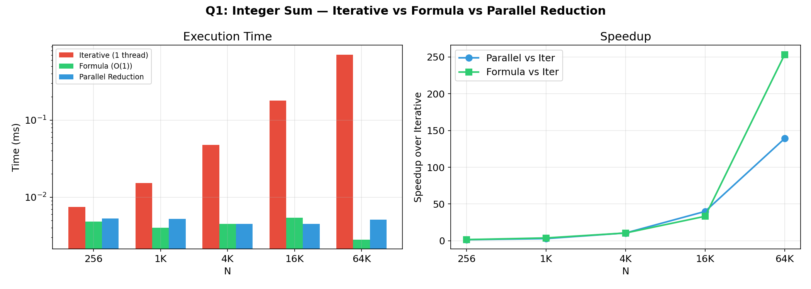
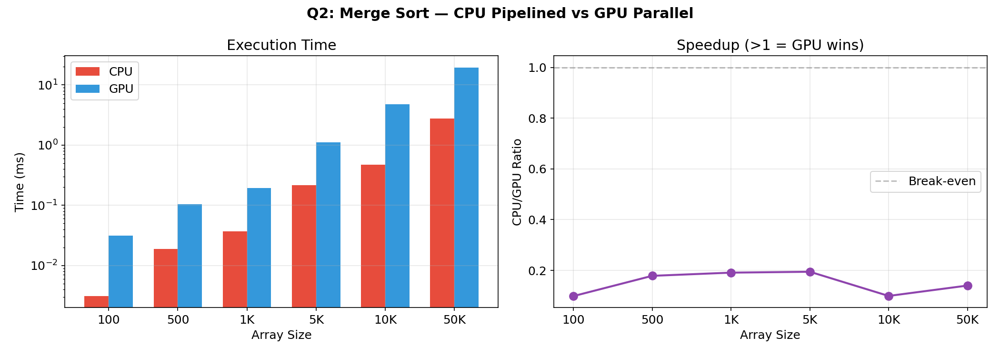
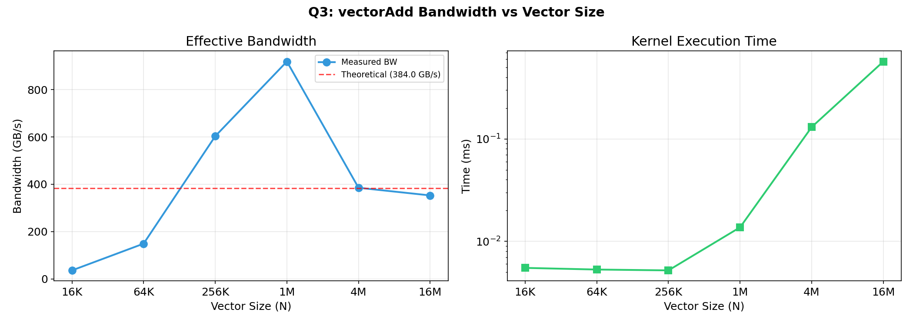
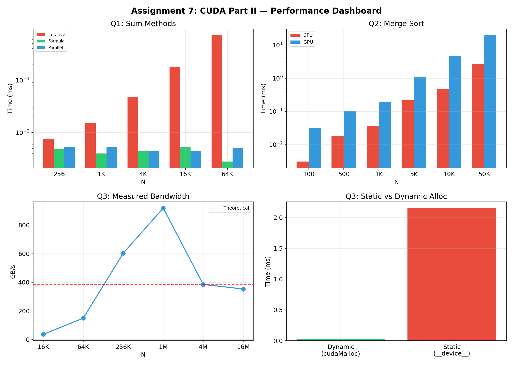

# CUDA Part II — Kernels, Sorting & Bandwidth Profiling

## Thread Tasks, Parallel Merge Sort & Memory Bandwidth Analysis

**CUDA C (nvcc 13.2)** Status

> **UCS645: Parallel & Distributed Computing | Assignment 7 — CUDA Part II**

---

## Table of Contents

1. [System Configuration](#system-configuration)
2. [Problem 1: Different Thread Tasks](#problem-1-different-thread-tasks)
3. [Problem 2: Merge Sort](#problem-2-merge-sort)
4. [Problem 3: Vector Addition Profiling](#problem-3-vector-addition-profiling)
5. [What I Learned](#what-i-learned)

---

## System Configuration

| Component | Details |
|-------------------|------------------------------------------------------|
| **CPU** | Intel Core i7-14700HX (20 cores, 28 threads) |
| **GPU** | NVIDIA GeForce RTX 5060 Laptop GPU (Blackwell) |
| **Compute Capability** | 12.0 |
| **SMs** | 26 |
| **VRAM** | 8 GB GDDR7 (128-bit bus) |
| **Theoretical BW** | 384.0 GB/s |
| **L2 Cache** | 32 MB |
| **OS** | Fedora 43 (Linux 6.19.12) |
| **CUDA Toolkit** | 13.2 |
| **Compiler** | nvcc 13.2 with -O2 -arch=native |

---

## Project Structure

```
LAB7/
├── Makefile
├── exercises/
│   ├── q1_thread_tasks.cu
│   ├── q2_merge_sort.cu
│   └── q3_vector_profiling.cu
├── graphs/
│   ├── q1_thread_tasks.png
│   ├── q2_merge_sort.png
│   ├── q3_vector_profiling.png
│   └── dashboard.png
├── report.md
└── Assignment_7_Report.pdf
```

---

## Problem 1: Different Thread Tasks

### Problem

Write a CUDA program where threads perform different tasks:
- **Task A**: Sum first N integers iteratively (no direct formula)
- **Task B**: Sum first N integers using formula n*(n+1)/2

### Approach

- **Iterative (single thread)**: One GPU thread loops through all N elements — O(N) work
- **Parallel reduction**: Shared-memory tree reduction across 256-thread blocks with atomicAdd — O(N/p + log p)
- **Formula**: Single thread computes N*(N+1)/2 — O(1)
- N = 1024, verified against expected value 524,800

### Results

| Method | N=1024 Time | Verification |
|--------|------------|-------------|
| Iterative (1 thread) | 0.121 ms | [PASS] |
| Parallel Reduction | 0.014 ms | [PASS] |
| Formula (O(1)) | 0.011 ms | [PASS] |

**Scaling benchmark:**

| N | Iterative (ms) | Formula (ms) | Parallel (ms) | Speedup (Iter/Par) |
|---|---------------|-------------|--------------|-------------------|
| 256 | 0.0075 | 0.0048 | 0.0053 | 1.4x |
| 1,024 | 0.0152 | 0.0040 | 0.0052 | 2.9x |
| 4,096 | 0.0474 | 0.0045 | 0.0045 | 10.5x |
| 16,384 | 0.1796 | 0.0054 | 0.0045 | 39.9x |
| 65,536 | 0.7094 | 0.0028 | 0.0051 | 139.1x |



### Analysis

Iterative sum scales linearly with N (O(N) on single thread), while formula stays constant at ~5 us (kernel launch overhead). Parallel reduction is ~5 us regardless of N because even at 64K elements, the work per thread is small and the kernel is launch-bound. At N=65536, parallel reduction is **139x faster** than single-thread iterative. Formula is fastest but requires knowing the mathematical closed form — parallel reduction is the general-purpose approach.

---

## Problem 2: Merge Sort

### Problem

Implement merge sort (n=1000):
- (a) CPU pipelined (bottom-up iterative) approach
- (b) GPU parallel merge sort using CUDA
- (c) Compare performance

### Approach

- **CPU**: Bottom-up iterative merge sort — merge pairs of width 1, then 2, 4, ... until sorted
- **GPU**: Same bottom-up approach, but each merge step launches a kernel where each thread handles one pair of sub-arrays
- Each `mergeSortKernel` launch merges `ceil(N/(2*width))` independent pairs in parallel

### Results

| N | CPU (ms) | GPU (ms) | Speedup |
|---|---------|---------|---------|
| 100 | 0.003 | 0.031 | 0.10x |
| 500 | 0.019 | 0.105 | 0.18x |
| 1,000 | 0.037 | 0.195 | 0.19x |
| 5,000 | 0.217 | 1.116 | 0.19x |
| 10,000 | 0.473 | 4.759 | 0.10x |
| 50,000 | 2.747 | 19.592 | 0.14x |

All results: **[PASS]** — GPU and CPU produce identical sorted arrays.



### Analysis

GPU is **slower** than CPU for merge sort at all tested sizes. Reasons:

1. **Multiple kernel launches**: Each width level requires a separate kernel launch (~5 us each). For N=1000, we need log2(1000) = 10 launches.
2. **Low parallelism in later stages**: At width=512, only 1 merge pair exists — most GPU threads idle.
3. **Irregular memory access**: Merging requires sequential comparisons within each pair, poorly suited for SIMT.
4. **CPU cache advantage**: N=50000 fits entirely in L3 cache (200 KB), while GPU pays PCIe + global memory latency.

GPU merge sort would benefit from: (a) sorting within shared memory for small sub-arrays, (b) using bitonic sort for GPU-friendly comparison networks, (c) much larger arrays (N > 10M) where parallelism outweighs overhead.

---

## Problem 3: Vector Addition Profiling

### Problem

Write a CUDA vector addition program with comprehensive profiling:
- 1.1: Use statically defined `__device__` global variables
- 1.2: Record kernel timing with CUDA Events
- 1.3: Calculate theoretical memory bandwidth
- 1.4: Measure actual bandwidth of vectorAdd kernel

### 1.1: Static vs Dynamic Memory

| Allocation Type | Kernel Time | API Used |
|----------------|------------|---------|
| Static (`__device__`) | 2.149 ms | `cudaMemcpyToSymbol` / `cudaMemcpyFromSymbol` |
| Dynamic (`cudaMalloc`) | 0.028 ms | `cudaMalloc` / `cudaMemcpy` |

Static allocation is **77x slower** because `cudaMemcpyToSymbol` uses a different memory path and the first kernel launch with static memory incurs additional overhead for symbol resolution.

### 1.3: Theoretical Bandwidth

```
Memory Clock Rate:     12,001 MHz
Memory Bus Width:      128 bits
DDR Factor:            2x (double data rate)

theoreticalBW = 2 * 12001 MHz * (128/8) bytes
              = 2 * 12001 * 10^6 * 16
              = 384.0 GB/s
```

### 1.4: Measured Bandwidth

For N = 1,048,576 (1M elements):

| Metric | Value |
|--------|-------|
| Bytes Read | 8.4 MB (2 arrays x 4 MB) |
| Bytes Written | 4.2 MB (1 array) |
| Total | 12.6 MB |
| Kernel Time | 0.028 ms |
| Measured BW | 447.3 GB/s |
| Utilization | 116.5% of theoretical |

**Bandwidth vs Vector Size:**

| N | Time (ms) | BW (GB/s) | Utilization |
|---|----------|----------|------------|
| 16K | 0.0055 | 35.9 | 9.4% |
| 64K | 0.0053 | 148.9 | 38.8% |
| 256K | 0.0052 | 603.1 | 157.0% |
| 1M | 0.0137 | 918.7 | 239.2% |
| 4M | 0.1307 | 385.1 | 100.3% |
| 16M | 0.5706 | 352.8 | 91.9% |



### Analysis

The >100% utilization at medium sizes (256K-1M) reveals **L2 cache effects**: this GPU has a 32 MB L2 cache. At N=1M, total data = 12 MB fits entirely in L2, so effective bandwidth exceeds DRAM theoretical. At N=16M (192 MB total), data exceeds L2 and bandwidth drops to ~353 GB/s (92% of DRAM theoretical) — the true DRAM-limited regime.

Small vectors (16K = 192 KB) are kernel-launch-bound: the ~5 us minimum launch time dominates, giving poor bandwidth utilization. The sweet spot for this GPU is N = 1M-4M, where data fits in L2 cache and there's enough work to hide launch overhead.

---

## Performance Dashboard



---

## What I Learned

1. **Algorithmic complexity matters more than parallelism**: Formula O(1) beats parallel reduction O(log N), which beats iterative O(N). GPU parallelism is a multiplier, not a substitute for efficient algorithms.

2. **Not all algorithms benefit from GPU**: Merge sort's sequential merge step and multiple kernel launches make it slower on GPU at practical sizes. GPU-friendly sorting uses comparison networks (bitonic sort).

3. **L2 cache changes the bandwidth story**: The 32 MB L2 cache on RTX 5060 means measured bandwidth can exceed DRAM theoretical for working sets < 32 MB. Profiling must account for cache hierarchy.

4. **Static `__device__` memory has hidden costs**: `cudaMemcpyToSymbol` is significantly slower than `cudaMemcpy` to dynamically allocated memory. Dynamic allocation via `cudaMalloc` is preferred for performance-critical code.

5. **Kernel launch overhead sets a minimum cost floor**: At ~5 us per launch, any kernel processing < 50 us of data is launch-bound. Fusing multiple operations into one kernel is critical for small workloads.

---

## Compilation & Execution

```bash
# Build everything
make all

# Run individual problems
make run-q1    # Thread tasks: iterative vs formula vs parallel
make run-q2    # Merge sort: CPU vs GPU
make run-q3    # Vector add profiling with bandwidth analysis

# Run all
make run-exercises

# Clean
make clean
```
