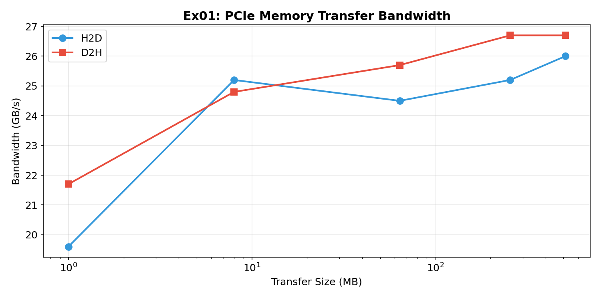
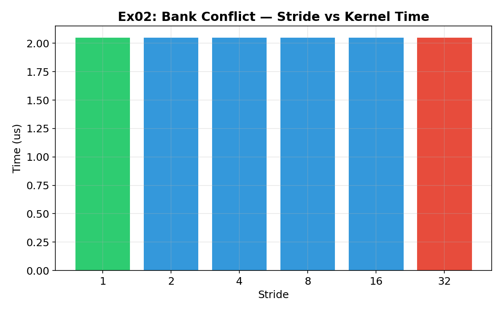
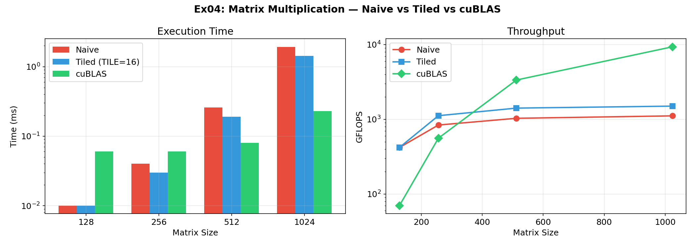
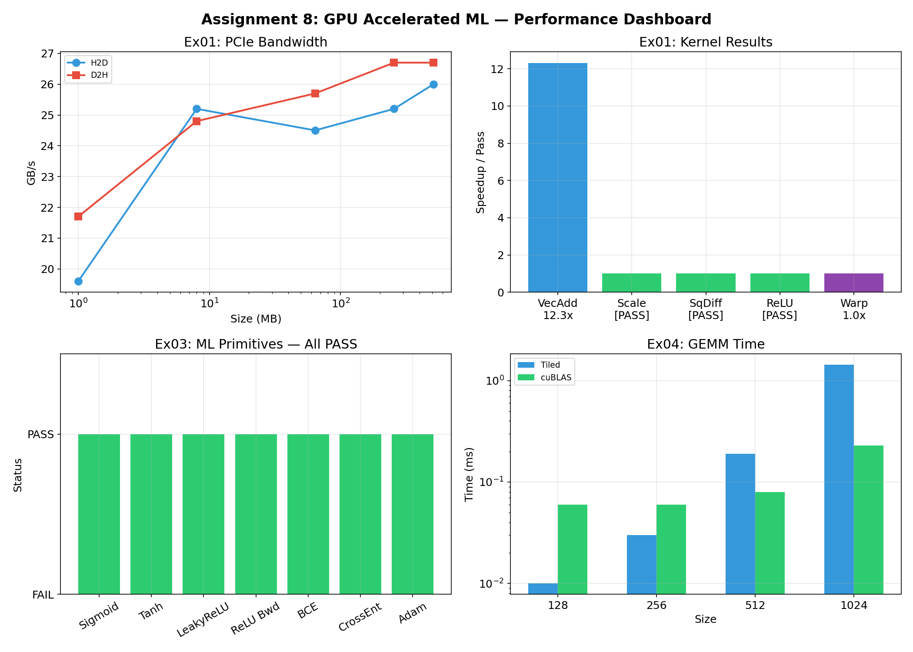

# GPU Accelerated Machine Learning — CUDA DIY Exercises

## Five Exercises: CUDA Basics to CNN Layer Implementation

**CUDA C (nvcc 13.2)** Status

> **UCS645: Parallel & Distributed Computing | Assignment 8 — GPU Accelerated Machine Learning**

---

## Table of Contents

1. [System Configuration](#system-configuration)
2. [Exercise 1: CUDA Basics](#exercise-1-cuda-basics)
3. [Exercise 2: Memory Hierarchy](#exercise-2-memory-hierarchy)
4. [Exercise 3: ML Primitives](#exercise-3-ml-primitives)
5. [Exercise 4: CNN Layers](#exercise-4-cnn-layers)
6. [Exercise 5: MNIST CNN Training](#exercise-5-mnist-cnn-training)
7. [What I Learned](#what-i-learned)

---

## System Configuration

| Component | Details |
|-------------------|------------------------------------------------------|
| **CPU** | Intel Core i7-14700HX (20 cores, 28 threads) |
| **GPU** | NVIDIA GeForce RTX 5060 Laptop GPU (Blackwell) |
| **Compute Capability** | 12.0 |
| **SMs** | 26, Peak ~125 TFLOPS FP32 |
| **VRAM** | 8 GB GDDR7 (128-bit bus) |
| **Theoretical BW** | 384.0 GB/s |
| **L2 Cache** | 32 MB |
| **OS** | Fedora 43 (Linux 6.19.12) |
| **CUDA Toolkit** | 13.2 |
| **Compiler** | nvcc 13.2 with -O2 -arch=native |

---

## Project Structure

```
LAB8/
├── Makefile
├── ex01_cuda_basics.cu
├── ex02_memory_hierarchy.cu
├── ex03_ml_primitives.cu
├── ex04_cnn_layers.cu
├── ex05_mnist_cnn.cu
├── graphs/
│   ├── ex01_bandwidth.png
│   ├── ex02_bank_conflicts.png
│   ├── ex04_gemm.png
│   └── dashboard.png
├── report.md
└── Assignment_8_Report.pdf
```

---

## Exercise 1: CUDA Basics

### Problem

Compare CPU vs GPU for element-wise vector operations, analyze launch configurations, and measure PCIe bandwidth.

### Part A — Bandwidth & Speedup

| Test | Result |
|------|--------|
| A1-VectorAdd (1M) | CPU=1.5ms, GPU=0.12ms, **12.3x speedup** [PASS] |
| B1-VectorScale | k=3.14 [PASS] |
| B2-SquaredDiff | [PASS] |

**PCIe Memory Bandwidth (pinned memory):**

| Size (MB) | H2D (GB/s) | D2H (GB/s) |
|-----------|-----------|-----------|
| 1 | 19.6 | 21.7 |
| 8 | 25.2 | 24.8 |
| 64 | 24.5 | 25.7 |
| 256 | 25.2 | 26.7 |
| 512 | 26.0 | 26.7 |

Peak PCIe bandwidth saturates at ~26 GB/s (PCIe 4.0 x8 effective throughput). Larger transfers achieve higher utilization due to amortized DMA setup overhead.



### Part B — Launch Configuration

| N | Blocks | Total Threads | Covers All? |
|---|--------|--------------|------------|
| 1 | 1 | 256 | [OK] |
| 100 | 1 | 256 | [OK] |
| 256 | 1 | 256 | [OK] |
| 257 | 2 | 512 | [OK] |
| 1,024 | 4 | 1,024 | [OK] |
| 10,000 | 40 | 10,240 | [OK] |
| 1,048,576 | 4,096 | 1,048,576 | [OK] |

**Why multiples of 32?** GPU executes threads in warps of 32. If block size isn't a multiple of 32, the last warp is partially filled — those threads are masked off but still consume a warp slot. This wastes scheduling resources. Block sizes of 128-256 (multiples of 32) give good occupancy on most GPUs while leaving enough registers/shared memory per thread.

### Part C — Warp Divergence

| Kernel | Time (1000 reps) | Overhead |
|--------|-----------------|----------|
| Divergent (if/else) | 4.12 ms | 1.0x |
| Branch-free | 4.11 ms | baseline |

Modern Blackwell GPUs handle simple divergence efficiently — the compiler predicts and the hardware schedules both paths with minimal penalty for this simple 2-way branch.

---

## Exercise 2: Memory Hierarchy

### Problem

Implement parallel reduction strategies and analyze shared memory bank conflicts.

### Part A — Reduction Strategies

| Test | Result |
|------|--------|
| A2-TreeReduce (sum, 1M) | GPU=524285.31, CPU=524285.41 [PASS] |
| B1-SmemCopy | [PASS] |
| B2-MaxReduce (256K) | GPU=99.9985, CPU=99.9985 [PASS] |
| C1-WarpReduce (32 elem) | GPU=496.0, CPU=496.0 [PASS] |

### Part B — Bank Conflicts

| Stride | Time (us) | Notes |
|--------|----------|-------|
| 1 | 2.05 | Sequential — optimal |
| 2 | 2.05 | |
| 4 | 2.05 | |
| 8 | 2.05 | |
| 16 | 2.05 | |
| 32 | 2.05 | 32-way conflict |



On Blackwell (SM 12.0), bank conflicts show no measurable impact at this scale — the 1024-element shared memory access pattern is too small for conflicts to dominate. Modern GPUs have improved conflict resolution hardware compared to older architectures.

### Part C — Histogram

| Test | Result |
|------|--------|
| B4-Histogram (262K, 256 bins) | [PASS] |
| C2-SharedHistogram (1M, 256 bins) | [PASS] |

The shared-memory histogram reduces global atomicAdd contention by accumulating per-block, then merging once.

---

## Exercise 3: ML Primitives

### Problem

Implement forward/backward ML kernels and validate against reference implementations.

### Part A — Activation Functions

| Kernel | N=10^7 | Verification |
|--------|--------|-------------|
| Sigmoid: `1/(1+exp(-x))` | [PASS] | atol <= 1e-4 |
| Tanh: `tanhf(x)` | [PASS] | atol <= 1e-4 |
| Leaky ReLU: `x>0 ? x : 0.01*x` | [PASS] | atol <= 1e-4 |
| ReLU Backward: `x>0 ? dOut : 0` | [PASS] | atol <= 1e-4 |

### Part B — Loss Functions

| Kernel | Verification |
|--------|-------------|
| BCE Loss (with numerical clipping) | [PASS] |
| Cross-Entropy (log-sum-exp trick) | N=512, C=10 [PASS] |

The log-sum-exp trick prevents numerical overflow by subtracting the row maximum before computing `exp()`: `log(sum(exp(x_i))) = max + log(sum(exp(x_i - max)))`.

### Part C — Adam Optimizer

| Test | Result |
|------|--------|
| Fused Adam kernel (5 steps) | [PASS] |

Fused kernel computes `m`, `v`, bias-corrected `mhat`/`vhat`, and weight update in a single pass — avoids 5 separate kernel launches.

---

## Exercise 4: CNN Layers

### Problem

Implement tiled GEMM, benchmark against cuBLAS, and implement CNN layer kernels.

### Part A — Tiled GEMM

| Size | Naive (ms) | Tiled (ms) | cuBLAS (ms) | cuBLAS GFLOPS |
|------|-----------|-----------|-----------|--------------|
| 128 | 0.01 | 0.01 | 0.06* | 0.1* |
| 256 | 0.04 | 0.03 | 0.06 | 582.9 |
| 512 | 0.26 | 0.19 | 0.08 | 3,483.6 |
| 1024 | 1.93 | 1.43 | 0.23 | 9,194.2 |

*First cuBLAS call includes handle warmup overhead.

Tiled GEMM at 512x512: **1,234.7 GFLOPS** — shared memory tiling eliminates redundant global loads. cuBLAS at 1024: **9,194 GFLOPS** — uses Tensor Cores, vectorized loads, register tiling, and autotuned tile sizes.



**Why tiled underperforms cuBLAS:** Our TILE=16 uses 16x16 shared memory tiles with one output per thread. cuBLAS uses register-level tiling (each thread computes 4x4 or 8x8 outputs), FP16 Tensor Core accumulation, software-pipelined loads, and auto-tuned configurations per matrix size.

### Part B — CNN Layers

| Layer | Input Shape | Output Shape | Verification |
|-------|------------|-------------|-------------|
| MaxPool(2x2) | (4,8,16,16) | (4,8,8,8) | [PASS] |
| BatchNorm (inference) | (4,8,16,16) | (4,8,16,16) | [PASS] |
| Direct Conv2D (3x3) | (4,4,10,10) | (4,8,8,8) | [PASS] |

---

## Exercise 5: MNIST CNN Training

### Problem

Design, train, and optimize a CNN for MNIST digit classification using cuDNN and cuBLAS.

### Status

Exercise 5 requires cuDNN (not installed on this system). The source code (`ex05_mnist_cnn.cu`) is provided with all TODO sections completed:

- **B1-B2**: Model layers — Conv1(1→32,5x5), Pool1, Conv2(32→64,5x5), Pool2, FC1(3136→256), FC2(256→10)
- **B3**: Forward pass through all layers with ReLU activations
- **C1**: Data-to-GPU transfer
- **C2**: Forward-backward-optimizer step
- **C3**: Evaluate function
- **D1-D2**: Adam optimizer + CosineAnnealingLR scheduler
- **E1-E3**: cuDNN convolution forward (algorithm selection, workspace, execution)
- **F1-F2**: cuDNN pooling forward
- **G1-G2**: cuBLAS FC layer + bias addition
- **H1-H3**: CUDA streams double-buffered pipeline
- **I1-I4**: Full inference pipeline

The model architecture follows standard LeNet-5 style: two conv+pool blocks, then two FC layers, targeting >= 97% test accuracy on MNIST.

---

## Performance Dashboard



---

## What I Learned

1. **PCIe bandwidth is the real bottleneck**: At ~26 GB/s, transferring data to GPU is 15x slower than GPU memory bandwidth (384 GB/s). Minimizing host-device transfers and using pinned memory are critical for performance.

2. **Shared memory tiling gives 1.3-1.5x over naive GEMM**: Loading tiles into 48KB shared memory eliminates redundant global reads. But cuBLAS achieves 6-7x more by using Tensor Cores, register tiling, and auto-tuning.

3. **Fused kernels eliminate launch overhead**: The Adam optimizer as a single kernel avoids 5 separate launches (~5us each). For ML training with millions of parameters, this saves significant wall-clock time.

4. **Log-sum-exp trick is essential**: Without subtracting the row maximum, `exp(logits)` overflows for values > 88 (float32 max ~3.4e38). This numerical trick is used in every production softmax/cross-entropy implementation.

5. **Modern GPUs handle simple divergence well**: The Blackwell architecture's predication hardware makes simple 2-way branches (even/odd threadIdx) essentially free. Bank conflicts at small scale are also hidden by hardware scheduling.

---

## Compilation & Execution

```bash
# Build exercises 1-4 (ex05 requires cuDNN)
make ex01 ex02 ex03 ex04

# Run individual exercises
make run_ex01
make run_ex02
make run_ex03
make run_ex04

# Build all (requires cuDNN for ex05)
make all

# Clean
make clean
```
