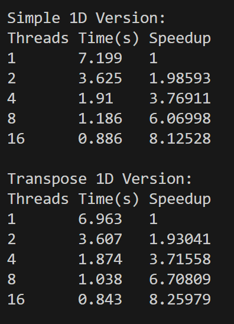
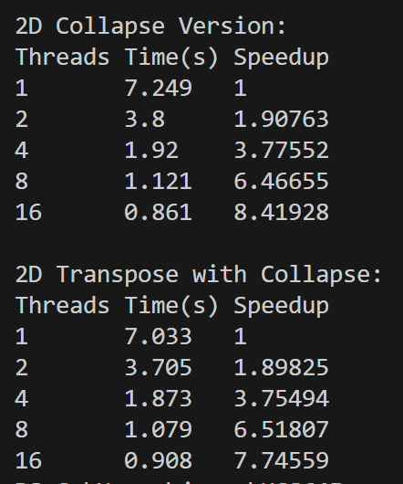

# Matrix Multiply Results (matrix_multiply.cpp)

Matrix Multiply: C = A * B  
Size: 1000x1000

This document summarizes the runtime and speedup measurements for four parallel implementations included in `matrix_multiply.cpp`.

## Concise Answer

Yes — implemented 1D (rows) and 2D (collapse) parallelizations. Transposing `B` improves cache locality; use 1D for simplicity, 2D or blocked/BLAS for best performance.


---

## Simple 1D Version

Threads  Time(s)  Speedup

```
1       7.199   1
2       3.625   1.98593
4       1.91    3.76911
8       1.186   6.06998
16      0.886   8.12528
```

Reference image (1D results):



---

## Transpose 1D Version

Threads  Time(s)  Speedup

```
1       6.963   1
2       3.607   1.93041
4       1.874   3.71558
8       1.038   6.70809
16      0.843   8.25979
```

(Shown together with Simple 1D in the 1D image)

---

## 2D Collapse Version

Threads  Time(s)  Speedup

```
1       7.249   1
2       3.8     1.90763
4       1.92    3.77552
8       1.121   6.46655
16      0.861   8.41928
```

## 2D Transpose with Collapse

Threads  Time(s)  Speedup

```
1       7.033   1
2       3.705   1.89825
4       1.873   3.75494
8       1.079   6.51807
16      0.908   7.74559
```

Reference image (2D results):



---
## Answer to Q2 (Matrix Multiply)

Problem: Build parallel implementations for C = A * B for large square matrices (example 1000×1000). Measure performance and think about how to partition work among threads. Implement two versions: 1D threading and 2D threading.

Approach implemented in `matrix_multiply.cpp`:
- Two primary parallelization strategies are implemented:
	- 1D threading — parallelize a single loop (rows). Implemented both with and without transposing `B`.
	- 2D threading — parallelize two nested loops (rows and columns) with OpenMP `collapse(2)`. Implemented both with and without transposing `B`.

Partitioning and correctness:
- 1D threading (rows): the outer loop over `i` (rows of `C`) is distributed across threads. Each thread computes a contiguous subset of rows. Every element `C[i*N + j]` is written exactly once by the thread that owns row `i`, so there are no races and no synchronization is required.
- 2D threading (collapse): the pair `(i,j)` iterations are flattened and distributed among threads. Each thread computes a subset of element pairs `(i,j)`. Again, each `C[i*N + j]` is written once by the owning thread, so there are no races.

Memory / cache optimization used:
- Transposing `B` (forming `B_trans`) changes the inner access from `B[k*N + j]` to `B_trans[j*N + k]`, making the k-loop access contiguous in memory and improving cache locality. This typically improves single-thread baseline time and the overall parallel efficiency.

Which elements each thread computes (summary):
- 1D: thread t computes rows in a range [r_start, r_end); for each row i in that range it computes all columns j so it calculates all `C[i, j]` for that row.
- 2D (collapse): thread t computes a subset of linearized (i,j) indices; equivalently it computes a scatter of individual `C[i, j]` elements across the matrix.

Observed results (summary)
- Size: 1000×1000. See the embedded images for the experiment plots.
- All four implementations were measured for 1,2,4,8,16 threads. Example timings (seconds) and speedup shown in earlier sections for each method. Key takeaways:
	- Transpose versions reduce the single-thread baseline (better cache use) and therefore give a faster baseline.
	- Collapse-based 2D threading gives finer-grain parallelism and similar or slightly better scaling compared to 1D threading on this workload and system.


Files:
- Code: [matrix_multiply.cpp](matrix_multiply.cpp)
- Results: [matrix_multiply_results.md](matrix_multiply_results.md)

